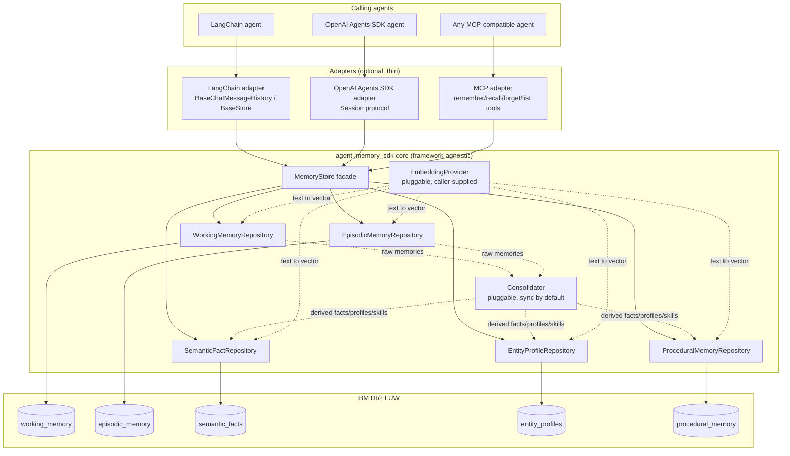
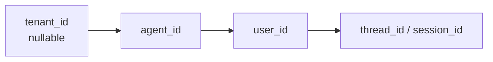
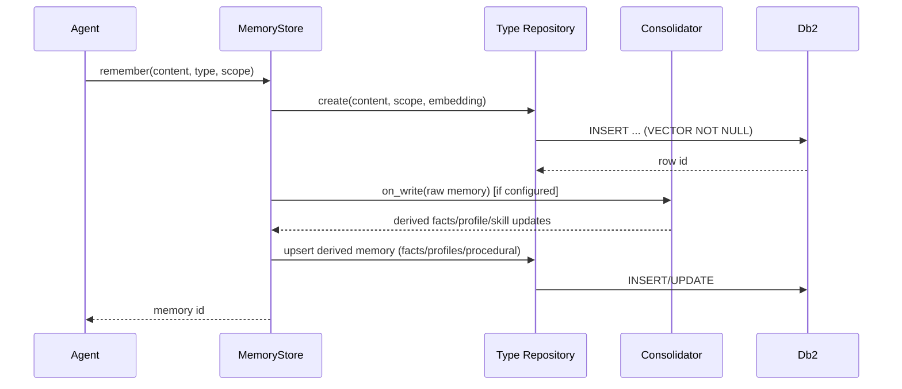
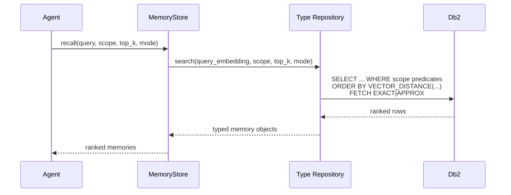

# Architecture — agent-memory-sdk

This is the **current-state** design doc — it describes what the system
looks like *right now*, and gets overwritten (not appended to) as the
build progresses. It complements [`DECISIONS.md`](DECISIONS.md), which is
the chronological log of *why* things are the way they are. When in doubt:
DECISIONS.md answers "why did we do it this way," this file answers "what
does it currently look like."

**Every step must update this file if it changes the design** — not just
DECISIONS.md. As of the last update, no code exists yet; the diagrams below
reflect the Step 0 architecture decisions and will be refined as each step
lands (see the "Last updated" line per section).

---

## 1. System overview

_Last updated: Step 3 — class/module names confirmed; actual files written_

Key points this diagram encodes (see DECISIONS.md for the reasoning):
- Adapters are optional and sit *outside* the core — core has zero
  framework dependencies.
- Every repository talks to its own Db2 table (normalized, not one
  polymorphic table).
- Consolidation is a pluggable callback the core *can* invoke inline; it's
  not a separate always-on service.
- Embeddings are supplied by the caller via `EmbeddingProvider`; the SDK
  doesn't ship a specific embedding model.

Actual module paths (as of Step 3):
- `src/agent_memory_sdk/types.py` — `EmbeddingProvider` (Protocol),
  `DistanceMetric` (enum), `SearchMode` (enum)
- `src/agent_memory_sdk/models.py` — `MemoryScope`, `WorkingMemory`,
  `EpisodicMemory`, `SemanticFact`, `EntityProfile`, `ProceduralMemory`
- `src/agent_memory_sdk/repositories/base.py` — `BaseRepository` ABC
- `src/agent_memory_sdk/repositories/working.py` — `WorkingMemoryRepository`
- `src/agent_memory_sdk/repositories/episodic.py` — `EpisodicMemoryRepository`
- `src/agent_memory_sdk/repositories/facts.py` — `SemanticFactRepository`
- `src/agent_memory_sdk/repositories/profiles.py` — `EntityProfileRepository`
- `src/agent_memory_sdk/repositories/procedural.py` — `ProceduralMemoryRepository`
- `src/agent_memory_sdk/store.py` — `MemoryStore` facade

---

## 2. Scoping model

_Last updated: Step 0 (design only, no code yet) — MemoryScope model built in Step 3_

Every row in every memory table carries all four columns. Every
`MemoryStore` call requires at least `agent_id`; queries always filter by
scope before ranking by vector distance. See `MemoryScope` (built in Step
5).

---

## 3. Schema (entity-relationship)

_Last updated: Step 2 — reflects actual DDL in `0002_memory_tables.sql`_

Column type legend:
- `id` → `VARCHAR(36)` (UUID)
- `*_id` scope cols → `VARCHAR(128)`, tenant_id nullable, agent_id NOT NULL
- `content` → `CLOB(65536)` (64 KB; see DECISIONS.md Step 2 entry)
- `metadata` → `VARCHAR(4096)` (JSON text; see DECISIONS.md Step 2 entry)
- `embedding` → `VECTOR(1536, FLOAT32) NOT NULL DEFAULT VECTOR_FILL(1536,FLOAT32,0.0)`
- `created_at`, `updated_at` → `TIMESTAMP NOT NULL DEFAULT CURRENT TIMESTAMP`
- `expires_at`, `deleted_at` → `TIMESTAMP` (nullable)
- `version` → `INTEGER NOT NULL DEFAULT 1`

Each table has: a `CREATE VECTOR INDEX … WITH DISTANCE COSINE`, a composite
scope index on `(agent_id, tenant_id, user_id, thread_id)`, an agent-only
index, and a partial index on `expires_at WHERE expires_at IS NOT NULL`.

Migration runner: `src/agent_memory_sdk/db/migrate.py` (Migrator class).
Migration files: `src/agent_memory_sdk/db/migrations/000N_*.sql`.

```mermaid
erDiagram
    schema_migrations {
        VARCHAR_255 version PK
        TIMESTAMP applied_at
    }

    working_memory {
        VARCHAR_36 id PK
        VARCHAR_128 tenant_id "nullable"
        VARCHAR_128 agent_id "NOT NULL"
        VARCHAR_128 user_id "nullable"
        VARCHAR_128 thread_id "nullable"
        CLOB_65536 content "NOT NULL"
        VARCHAR_4096 metadata "NOT NULL default {}"
        VECTOR_1536_FLOAT32 embedding "NOT NULL default zero-vec"
        TIMESTAMP created_at "NOT NULL"
        TIMESTAMP updated_at "NOT NULL"
        TIMESTAMP expires_at "nullable"
        INTEGER version "NOT NULL default 1"
        TIMESTAMP deleted_at "nullable"
    }

    episodic_memory {
        VARCHAR_36 id PK
        VARCHAR_128 tenant_id "nullable"
        VARCHAR_128 agent_id "NOT NULL"
        VARCHAR_128 user_id "nullable"
        VARCHAR_128 thread_id "nullable"
        CLOB_65536 content "NOT NULL"
        VARCHAR_4096 metadata "NOT NULL default {}"
        VECTOR_1536_FLOAT32 embedding "NOT NULL default zero-vec"
        TIMESTAMP created_at "NOT NULL"
        TIMESTAMP updated_at "NOT NULL"
        TIMESTAMP expires_at "nullable"
        INTEGER version "NOT NULL default 1"
        TIMESTAMP deleted_at "nullable"
    }

    semantic_facts {
        VARCHAR_36 id PK
        VARCHAR_128 tenant_id "nullable"
        VARCHAR_128 agent_id "NOT NULL"
        VARCHAR_128 user_id "nullable"
        VARCHAR_128 thread_id "nullable"
        CLOB_65536 content "NOT NULL"
        VARCHAR_4096 metadata "NOT NULL default {}"
        VECTOR_1536_FLOAT32 embedding "NOT NULL default zero-vec"
        TIMESTAMP created_at "NOT NULL"
        TIMESTAMP updated_at "NOT NULL"
        TIMESTAMP expires_at "nullable"
        INTEGER version "NOT NULL default 1"
        TIMESTAMP deleted_at "nullable"
    }

    entity_profiles {
        VARCHAR_36 id PK
        VARCHAR_128 tenant_id "nullable"
        VARCHAR_128 agent_id "NOT NULL"
        VARCHAR_128 user_id "nullable"
        VARCHAR_128 thread_id "nullable"
        CLOB_65536 content "NOT NULL"
        VARCHAR_4096 metadata "NOT NULL default {}"
        VECTOR_1536_FLOAT32 embedding "NOT NULL default zero-vec"
        TIMESTAMP created_at "NOT NULL"
        TIMESTAMP updated_at "NOT NULL"
        TIMESTAMP expires_at "nullable"
        INTEGER version "NOT NULL default 1"
        TIMESTAMP deleted_at "nullable"
    }

    procedural_memory {
        VARCHAR_36 id PK
        VARCHAR_128 tenant_id "nullable"
        VARCHAR_128 agent_id "NOT NULL"
        VARCHAR_128 user_id "nullable"
        VARCHAR_128 thread_id "nullable"
        CLOB_65536 content "NOT NULL"
        VARCHAR_4096 metadata "NOT NULL default {}"
        VECTOR_1536_FLOAT32 embedding "NOT NULL default zero-vec"
        TIMESTAMP created_at "NOT NULL"
        TIMESTAMP updated_at "NOT NULL"
        TIMESTAMP expires_at "nullable"
        INTEGER version "NOT NULL default 1"
        TIMESTAMP deleted_at "nullable"
    }
```

---

## 4. Flow: `remember()`

_Last updated: Step 0 (design only); Step 3 implements repos that execute these queries_

## 5. Flow: `recall()` / semantic search

_Last updated: Step 0 (design only); Step 3 implements repos that execute these queries_

---

## Where design docs live vs. Bob's MCP tools

We evaluated Bob's connected MCP tools (Jira, Airtable, Amplitude, Carbon,
Figma, Monday.com, Mural, Product Knowledge, Web search) for storing
architecture/flow design and none fit: Mural's MCP access is read-only,
Product Knowledge is a read-only search index over IBM's own docs, Jira is
a tracker not a design-doc tool, Figma/Carbon are UI-only, and
Airtable/Amplitude/Monday.com don't fit this project (see DECISIONS.md
2026-07-30 entry). This file — versioned with the code, diffable, no
external auth dependency — is the actual answer. Jira Stories may *link* to
this file, but should not duplicate its content.
