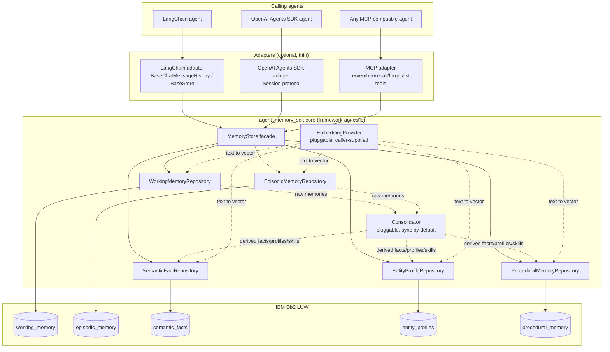
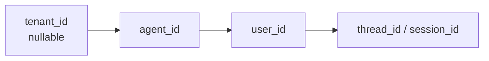
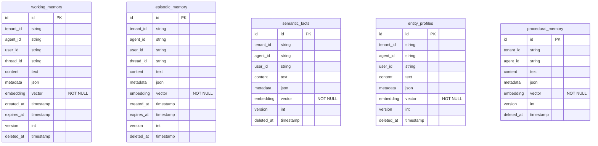
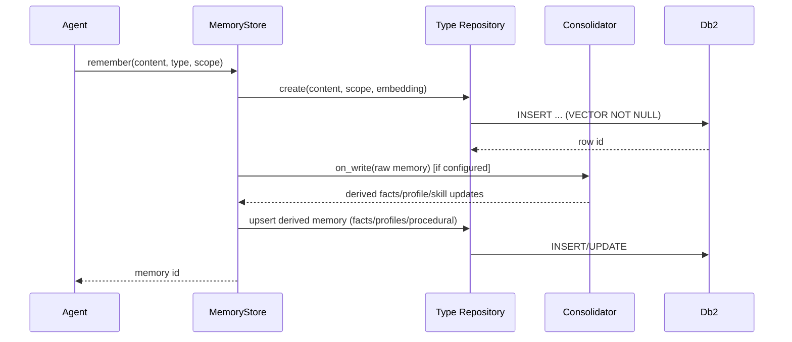
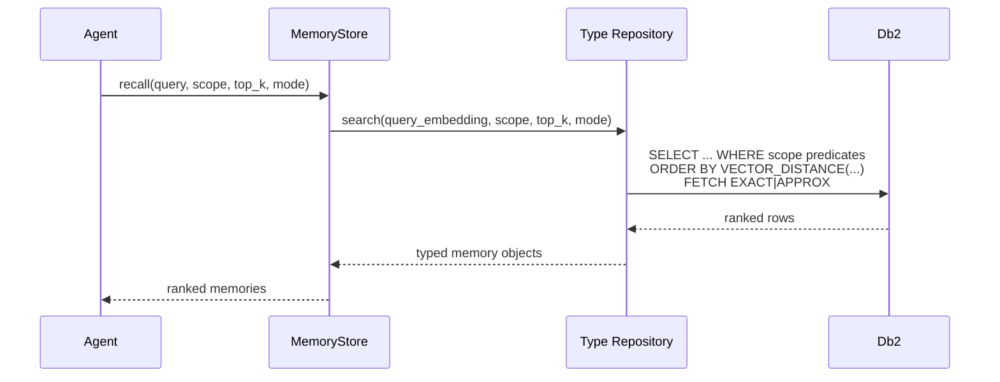

# Architecture — agent-memory-sdk

This is the **current-state** design doc — it describes what the system
looks like *right now*, and gets overwritten (not appended to) as the
build progresses. It complements [`DECISIONS.md`](DECISIONS.md), which is
the chronological log of *why* things are the way they are. When in doubt:
DECISIONS.md answers "why did we do it this way," this file answers "what
does it currently look like."

**Every step must update this file if it changes the design** — not just
DECISIONS.md. As of the last update, no code exists yet; the diagrams below
reflect the Step 0 architecture decisions and will be refined as each step
lands (see the "Last updated" line per section).

---

## 1. System overview

_Last updated: Step 0 (design only, no code yet)_

Key points this diagram encodes (see DECISIONS.md for the reasoning):
- Adapters are optional and sit *outside* the core — core has zero
  framework dependencies.
- Every repository talks to its own Db2 table (normalized, not one
  polymorphic table).
- Consolidation is a pluggable callback the core *can* invoke inline; it's
  not a separate always-on service.
- Embeddings are supplied by the caller via `EmbeddingProvider`; the SDK
  doesn't ship a specific embedding model.

---

## 2. Scoping model

_Last updated: Step 0 (design only, no code yet)_

Every row in every memory table carries all four columns. Every
`MemoryStore` call requires at least `agent_id`; queries always filter by
scope before ranking by vector distance. See `MemoryScope` (built in Step
5).

---

## 3. Schema (entity-relationship)

_Last updated: Step 0 (design only — exact column types/metrics chosen in
Step 2, this diagram should be revised to match)_

---

## 4. Flow: `remember()`

_Last updated: Step 0 (design only, no code yet)_

## 5. Flow: `recall()` / semantic search

_Last updated: Step 0 (design only, no code yet)_

---

## Where design docs live vs. Bob's MCP tools

We evaluated Bob's connected MCP tools (Jira, Airtable, Amplitude, Carbon,
Figma, Monday.com, Mural, Product Knowledge, Web search) for storing
architecture/flow design and none fit: Mural's MCP access is read-only,
Product Knowledge is a read-only search index over IBM's own docs, Jira is
a tracker not a design-doc tool, Figma/Carbon are UI-only, and
Airtable/Amplitude/Monday.com don't fit this project (see DECISIONS.md
2026-07-30 entry). This file — versioned with the code, diffable, no
external auth dependency — is the actual answer. Jira Stories may *link* to
this file, but should not duplicate its content.
