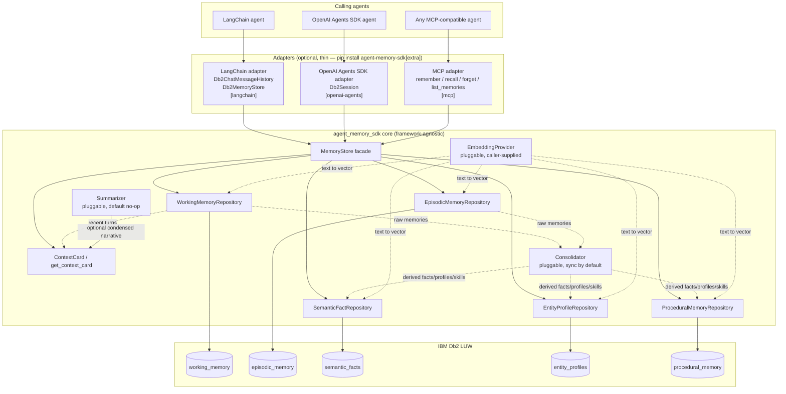
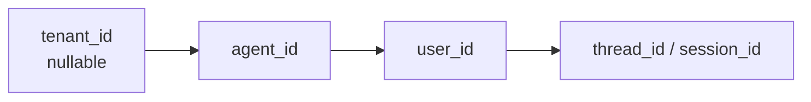
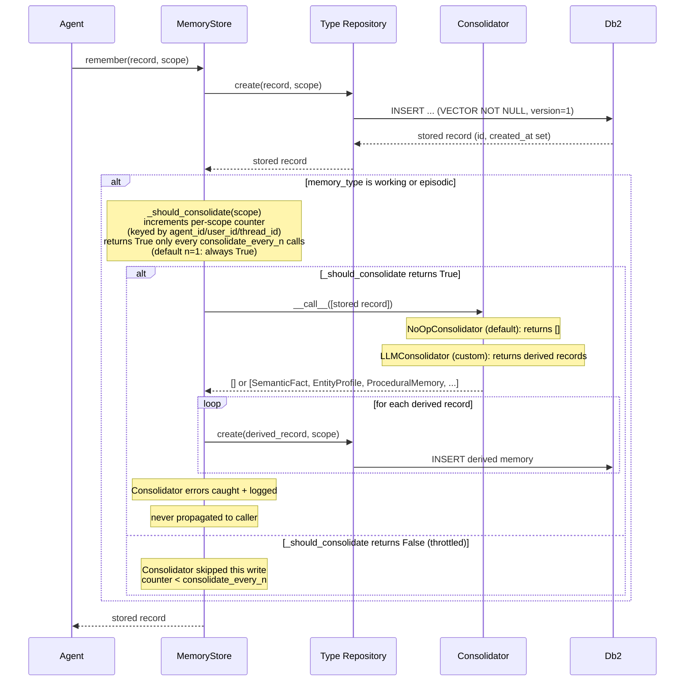
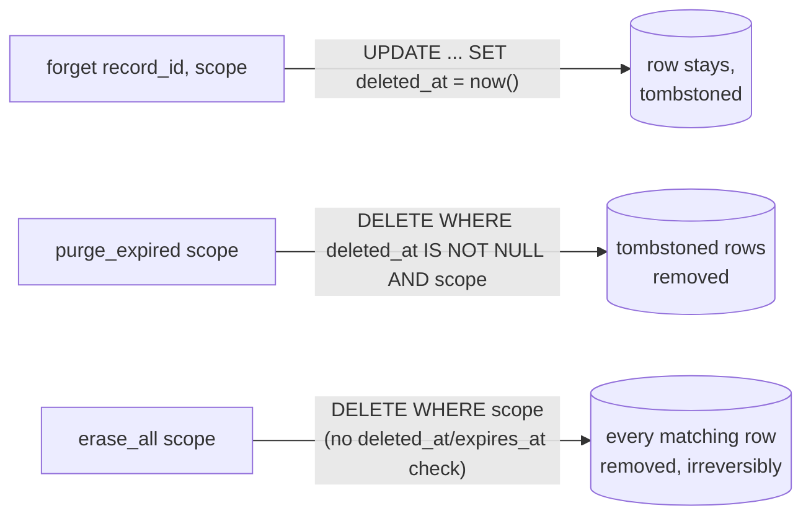

# Architecture — agent-memory-sdk

This is the **current-state** design doc — it describes what the system
looks like *right now*, and gets overwritten (not appended to) as the
build progresses. It complements [`DECISIONS.md`](DECISIONS.md), which is
the chronological log of *why* things are the way they are. When in doubt:
DECISIONS.md answers "why did we do it this way," this file answers "what
does it currently look like."

**Every step must update this file if it changes the design** — not just
DECISIONS.md. As of the last update, no code exists yet; the diagrams below
reflect the Step 0 architecture decisions and will be refined as each step
lands (see the "Last updated" line per section).

---

## 1. System overview

_Last updated: ORC-3 — `metadata_filter` parameter added to `search()`/`list_all()`_



Key points this diagram encodes (see DECISIONS.md for the reasoning):
- Adapters are optional and sit *outside* the core — core has zero
  framework dependencies.  Each adapter is gated behind its own extras
  group in `pyproject.toml`.
- Every repository talks to its own Db2 table (normalized, not one
  polymorphic table).
- Consolidation is a pluggable callback the core *can* invoke inline; it's
  not a separate always-on service.
- Context-card assembly is also in the core: `MemoryStore.get_context_card()`
  is a read-only convenience layer over recent `working_memory` rows, with an
  optional pluggable `Summarizer` callback for callers who want a condensed
  narrative in addition to the raw turns.
- Embeddings are supplied by the caller via `EmbeddingProvider`; the SDK
  doesn't ship a specific embedding model.

Actual module paths (as of PIPE-5):
- `src/agent_memory_sdk/types.py` — `EmbeddingProvider` (Protocol),
  `Consolidator` (Protocol), `NoOpConsolidator` (default no-op),
  `Summarizer` (Protocol), `NoOpSummarizer` (default no-op),
  `ContextCard` (dataclass), `ErasureReport` (dataclass, PIPE-5),
  `DistanceMetric` (enum), `SearchMode` (enum)
- `src/agent_memory_sdk/exceptions.py` — `StaleWriteError`, `InvalidMetadataFilterError`
- `src/agent_memory_sdk/models.py` — `MemoryScope`, `WorkingMemory`,
  `EpisodicMemory`, `SemanticFact`, `EntityProfile`, `ProceduralMemory`
- `src/agent_memory_sdk/repositories/base.py` — `BaseRepository` ABC
  (includes `forget`, `update`, `purge_expired` since Step 4; `_build_metadata_filter()`,
  `_escape_json_path_value()` since ORC-3; `erase_all()` since PIPE-5 — unconditional
  scope-predicated hard-delete, bypassing the `deleted_at`/`expires_at` gating that
  `purge_expired()` still respects)
- `src/agent_memory_sdk/repositories/working.py` — `WorkingMemoryRepository`
- `src/agent_memory_sdk/repositories/episodic.py` — `EpisodicMemoryRepository`
- `src/agent_memory_sdk/repositories/facts.py` — `SemanticFactRepository`
- `src/agent_memory_sdk/repositories/profiles.py` — `EntityProfileRepository`
- `src/agent_memory_sdk/repositories/procedural.py` — `ProceduralMemoryRepository`
- `src/agent_memory_sdk/repositories/chunks.py` — `ChunkRepository`
  (includes `erase_by_scope()` since PIPE-5 — the `memory_chunks` counterpart
  to `BaseRepository.erase_all()`, since chunk rows carry no tombstone
  lifecycle of their own)
- `src/agent_memory_sdk/store.py` — `MemoryStore` facade
  (includes `remember`, `forget`, `purge_expired` since Step 4, `get_context_card`
  since ORC-1, and `erase_all()` since PIPE-5 — hard-deletes every row matching
  a scope across all five repositories plus `memory_chunks` and returns an
  `ErasureReport`)
- `src/agent_memory_sdk/adapters/__init__.py` — adapter package (docstring only)
- `src/agent_memory_sdk/adapters/langchain.py` — `Db2ChatMessageHistory`
  (LangChain `BaseChatMessageHistory` backed by `store.working`) +
  `Db2MemoryStore` (LangChain `BaseStore[str, str]` backed by
  `store.facts` or `store.profiles`)
- `src/agent_memory_sdk/adapters/openai_agents.py` — `Db2Session`
  (OpenAI Agents SDK `Session` protocol backed by `store.working`;
  bonus `recall_episodes()` via `store.episodic`)
- `src/agent_memory_sdk/adapters/mcp_server.py` — `create_server(store)`
  factory returning an MCP `Server` with four tools: `remember`,
  `recall`, `forget`, `list_memories`
- `scripts/purge_expired.py` — cron-callable maintenance script
- `scripts/consolidate_pending.py` — reference async consolidation pattern

---

## 2. Scoping model

_Last updated: Step 0 (design only, no code yet) — MemoryScope model built in Step 3_



Every row in every memory table carries all four columns. Every
`MemoryStore` call requires at least `agent_id`; queries always filter by
scope before ranking by vector distance. See `MemoryScope` (built in Step
5).

---

## 3. Schema (entity-relationship)

_Last updated: ORC-2 — `memory_chunks` table added (migration 0006) for content chunking_

Column type legend:
- `id` → `VARCHAR(36)` (UUID)
- `*_id` scope cols → `VARCHAR(128)`, tenant_id nullable, agent_id NOT NULL
- `content` → `CLOB(65536)` (64 KB; see DECISIONS.md Step 2 entry)
- `metadata` → `VARCHAR(4096)` (JSON text; see DECISIONS.md Step 2 entry)
- `embedding` → `VECTOR(1536, FLOAT32) NOT NULL` (no DB-side default; application layer always supplies an explicit vector — real embedding or zero-vector sentinel — on every INSERT)
- `confidence` → `DOUBLE NOT NULL DEFAULT 1.0` (grounding-certainty score 0.0–1.0; see DECISIONS.md ENH-1 entry)
- `content_hash` → `VARCHAR(64)` nullable (hex SHA-256 of normalized content; NULL for rows written before migration 0003; see DECISIONS.md ENH-2 entry)
- `created_at`, `updated_at` → `TIMESTAMP NOT NULL DEFAULT CURRENT TIMESTAMP`
- `expires_at`, `deleted_at` → `TIMESTAMP` (nullable)
- `version` → `INTEGER NOT NULL DEFAULT 1`
- `consolidated_at` → `TIMESTAMP` nullable (`working_memory` and `episodic_memory` only; NULL = not yet processed by the background worker; set to current timestamp when the worker claims the row via `_claim_consolidated()`; see DECISIONS.md ENH-4 entry)
- `superseded_by` → `VARCHAR(36)` nullable (id of the winning row; `semantic_facts` only; NULL = this fact is still live; see DECISIONS.md ENH-3 entry)
- `superseded_at` → `TIMESTAMP` nullable (`semantic_facts` only; NULL = live)
- `supersede_reason` → `VARCHAR(255)` nullable (`semantic_facts` only; human-readable reason set by the Reconciler)

**ORC-2 companion table:** `memory_chunks` stores overlapping fixed-size character chunks for parent records whose content exceeds the configurable `chunk_threshold` (default 2000 chars).  Each chunk has its own `VECTOR(1536, FLOAT32) NOT NULL` embedding and scope columns.  When a parent row is long enough to be chunked, its own `embedding` column is set to the zero-vector sentinel (satisfying NOT NULL) and semantic search routes through `memory_chunks`.  When content is short, no chunk rows are created and the system behaves exactly as before ORC-2.  See DECISIONS.md ORC-2 entry for the threshold, overlap strategy, shared-vs-per-type table decision, and chunk-to-parent resolution logic.

Each table has: a `CREATE VECTOR INDEX … WITH DISTANCE COSINE`, a composite
scope index on `(agent_id, tenant_id, user_id, thread_id)`, an agent-only
index, and a plain (unfiltered) index on `expires_at`.  The `WHERE expires_at
IS NOT NULL` predicate was removed from all five `ix_*_expires` indexes in
migration `0002` because Db2 12.1.5 fp0 does not support partial (filtered)
indexes (`SQL0104N`).  Rows with NULL `expires_at` incur negligible extra
index overhead.

Migration runner: `src/agent_memory_sdk/db/migrate.py` (Migrator class).
Migration files: `src/agent_memory_sdk/db/migrations/000N_*.sql`.

```mermaid
erDiagram
    schema_migrations {
        VARCHAR_255 version PK
        TIMESTAMP applied_at
    }

    working_memory {
        VARCHAR_36 id PK
        VARCHAR_128 tenant_id "nullable"
        VARCHAR_128 agent_id "NOT NULL"
        VARCHAR_128 user_id "nullable"
        VARCHAR_128 thread_id "nullable"
        CLOB_65536 content "NOT NULL"
        VARCHAR_4096 metadata "NOT NULL default {}"
        VECTOR_1536_FLOAT32 embedding "NOT NULL, app-supplied"
        DOUBLE confidence "NOT NULL default 1.0"
        VARCHAR_64 content_hash "nullable, hex SHA-256"
        TIMESTAMP created_at "NOT NULL"
        TIMESTAMP updated_at "NOT NULL"
        TIMESTAMP expires_at "nullable"
        INTEGER version "NOT NULL default 1"
        TIMESTAMP deleted_at "nullable"
        TIMESTAMP consolidated_at "nullable, ENH-4"
    }

    episodic_memory {
        VARCHAR_36 id PK
        VARCHAR_128 tenant_id "nullable"
        VARCHAR_128 agent_id "NOT NULL"
        VARCHAR_128 user_id "nullable"
        VARCHAR_128 thread_id "nullable"
        CLOB_65536 content "NOT NULL"
        VARCHAR_4096 metadata "NOT NULL default {}"
        VECTOR_1536_FLOAT32 embedding "NOT NULL, app-supplied"
        DOUBLE confidence "NOT NULL default 1.0"
        VARCHAR_64 content_hash "nullable, hex SHA-256"
        TIMESTAMP created_at "NOT NULL"
        TIMESTAMP updated_at "NOT NULL"
        TIMESTAMP expires_at "nullable"
        INTEGER version "NOT NULL default 1"
        TIMESTAMP deleted_at "nullable"
        TIMESTAMP consolidated_at "nullable, ENH-4"
    }

    semantic_facts {
        VARCHAR_36 id PK
        VARCHAR_128 tenant_id "nullable"
        VARCHAR_128 agent_id "NOT NULL"
        VARCHAR_128 user_id "nullable"
        VARCHAR_128 thread_id "nullable"
        CLOB_65536 content "NOT NULL"
        VARCHAR_4096 metadata "NOT NULL default {}"
        VECTOR_1536_FLOAT32 embedding "NOT NULL, app-supplied"
        DOUBLE confidence "NOT NULL default 1.0"
        VARCHAR_64 content_hash "nullable, hex SHA-256"
        TIMESTAMP created_at "NOT NULL"
        TIMESTAMP updated_at "NOT NULL"
        TIMESTAMP expires_at "nullable"
        INTEGER version "NOT NULL default 1"
        TIMESTAMP deleted_at "nullable"
        VARCHAR_36 superseded_by "nullable, winner row id"
        TIMESTAMP superseded_at "nullable, ENH-3"
        VARCHAR_255 supersede_reason "nullable, Reconciler reason"
    }

    entity_profiles {
        VARCHAR_36 id PK
        VARCHAR_128 tenant_id "nullable"
        VARCHAR_128 agent_id "NOT NULL"
        VARCHAR_128 user_id "nullable"
        VARCHAR_128 thread_id "nullable"
        CLOB_65536 content "NOT NULL"
        VARCHAR_4096 metadata "NOT NULL default {}"
        VECTOR_1536_FLOAT32 embedding "NOT NULL, app-supplied"
        DOUBLE confidence "NOT NULL default 1.0"
        VARCHAR_64 content_hash "nullable, hex SHA-256"
        TIMESTAMP created_at "NOT NULL"
        TIMESTAMP updated_at "NOT NULL"
        TIMESTAMP expires_at "nullable"
        INTEGER version "NOT NULL default 1"
        TIMESTAMP deleted_at "nullable"
    }

    procedural_memory {
        VARCHAR_36 id PK
        VARCHAR_128 tenant_id "nullable"
        VARCHAR_128 agent_id "NOT NULL"
        VARCHAR_128 user_id "nullable"
        VARCHAR_128 thread_id "nullable"
        CLOB_65536 content "NOT NULL"
        VARCHAR_4096 metadata "NOT NULL default {}"
        VECTOR_1536_FLOAT32 embedding "NOT NULL, app-supplied"
        DOUBLE confidence "NOT NULL default 1.0"
        VARCHAR_64 content_hash "nullable, hex SHA-256"
        TIMESTAMP created_at "NOT NULL"
        TIMESTAMP updated_at "NOT NULL"
        TIMESTAMP expires_at "nullable"
        INTEGER version "NOT NULL default 1"
        TIMESTAMP deleted_at "nullable"
    }

    memory_chunks {
        VARCHAR_36 id PK
        VARCHAR_64 source_table "NOT NULL, e.g. working_memory"
        VARCHAR_36 source_id "NOT NULL, FK to parent id"
        INTEGER chunk_index "NOT NULL, 0-based ordinal"
        CLOB_4096 chunk_text "NOT NULL"
        VECTOR_1536_FLOAT32 embedding "NOT NULL, per-chunk embedding"
        VARCHAR_128 tenant_id "nullable, replicated from parent"
        VARCHAR_128 agent_id "NOT NULL, replicated from parent"
        VARCHAR_128 user_id "nullable"
        VARCHAR_128 thread_id "nullable"
        TIMESTAMP created_at "NOT NULL"
    }
```



`memory_chunks` indexes: `CREATE VECTOR INDEX ix_memory_chunks_embedding WITH DISTANCE COSINE`, `ix_memory_chunks_parent ON (agent_id, source_table, source_id)`, `ix_memory_chunks_scope ON (agent_id, tenant_id, user_id, thread_id)`.

---

## 4. Flow: `remember()`

_Last updated: ENH-4 — `_should_consolidate()` throttle gate added between write and Consolidator_



**Async / out-of-band path (ENH-4 — production-grade):**
When consolidation is too slow for the inline path, leave the default
`NoOpConsolidator` in place and run `scripts/consolidate_pending.py` as a
cron job.  The worker scans for `consolidated_at IS NULL` rows (ENH-4
migration 0005 column), claims each with a `SET consolidated_at = <now>`
UPDATE (preventing double-processing by concurrent workers), runs the
Consolidator off the hot path, and persists derived memories.  See
DECISIONS.md ENH-4 entry for the full design rationale and known limitations.

## 5. Flow: `recall()` / semantic search

_Last updated: ORC-3 — `metadata_filter` predicate injection documented (applied in step 1, before distance ranking)_

```mermaid
sequenceDiagram
    participant Agent
    participant MemoryStore
    participant Repo as Type Repository
    participant Db2

    Agent->>MemoryStore: recall(query, scope, top_k, mode)
    MemoryStore->>Repo: search(query_embedding, scope, top_k, mode)

    note over Repo: Step 1 — rank by distance, return IDs only<br/>(no VECTOR_SERIALIZE in SELECT list;<br/>metadata_filter predicates appended here — rows excluded by filter do not consume top_k slots)
    Repo->>Db2: SELECT id FROM &lt;table&gt;<br/>WHERE &lt;scope&gt; AND deleted_at IS NULL<br/>  [AND JSON_VALUE(metadata, '$.field') = ? ...]<br/>ORDER BY VECTOR_DISTANCE(embedding, CAST('…' AS VECTOR), COSINE)<br/>FETCH FIRST top_k ROWS ONLY [APPROX]
    Db2-->>Repo: ordered_ids (nearest-first)

    note over Repo: Step 2 — fetch full rows by ID<br/>(uses VECTOR_SERIALIZE in SELECT)
    Repo->>Db2: SELECT id, …, VECTOR_SERIALIZE(embedding) AS embedding, …<br/>FROM &lt;table&gt; WHERE id IN (id1, id2, …) AND deleted_at IS NULL
    Db2-->>Repo: unordered full rows

    note over Repo: Reorder rows in Python to restore<br/>nearest-first ordering from step 1
    Repo-->>MemoryStore: typed memory objects (nearest-first)
    MemoryStore-->>Agent: ranked memories
```

---


---

## 6. Metadata filter — `search()` / `list_all()` (ORC-3)

_Last updated: ORC-3_

Both `BaseRepository.search()` and `BaseRepository.list_all()` accept an
optional `metadata_filter: dict[str, Any] | None = None` parameter (default
`None` — backward-compatible no-op).  When set, the filter dict is translated
by `_build_metadata_filter()` (pure function in `repositories/base.py`) into
SQL predicates on the `metadata VARCHAR(4096)` JSON column.  **No schema
change** — the column has existed since migration `0002`.

### Supported operator set (four operators, deliberately small)

| Pattern | Filter dict | Generated SQL |
|---|---|---|
| Exact match | `{"source": "support"}` | `JSON_VALUE(metadata, '$.source') = ?`  (bound param: `"support"`) |
| `$not` | `{"status": {"$not": "archived"}}` | `JSON_VALUE(metadata, '$.status') <> ?` |
| `$array_contains` | `{"tags": {"$array_contains": "urgent"}}` | `JSON_EXISTS(metadata, '$.tags[*]?(@ == "urgent")') = 'true'` |
| `$array_contains_any` | `{"tags": {"$array_contains_any": ["a","b"]}}` | `(JSON_EXISTS(…"a"…) = 'true' OR JSON_EXISTS(…"b"…) = 'true')` |

Multiple fields are combined with AND.  All predicates are appended after
existing scope, `deleted_at IS NULL`, TTL, confidence, and supersession
predicates.

### Implementation details

- **`_build_metadata_filter(filter)`** — pure function returning
  `(sql_fragment, params)`.  The fragment is a space-prefixed `AND …` string
  ready to embed in any WHERE clause.  Returns `("", [])` for `None`/`{}`.
- **`_escape_json_path_value(val)`** — helper for inlining values safely in
  `JSON_EXISTS` path expressions (Db2 12.1.5 fp0 does not support binding
  values into path expressions via `?`, the same constraint documented for
  vector literals).
- **`InvalidMetadataFilterError(ValueError)`** in `exceptions.py` — raised
  immediately (before any SQL) for unrecognized `$`-prefixed operators, invalid
  field names, or non-scalar/non-dict operands.  Exported from
  `agent_memory_sdk.__init__`.

### WHERE clause position in `list_all()`

```sql
WHERE <scope predicates>
  AND deleted_at IS NULL
  AND superseded_at IS NULL          -- SemanticFactRepository only
  AND (expires_at IS NULL OR …)      -- when include_expired=False
  AND confidence >= ?                -- when min_confidence > 0.0
  AND JSON_VALUE(…) = ?              -- metadata_filter exact-match predicates
  …                                  -- additional metadata predicates
ORDER BY created_at DESC
FETCH FIRST ? ROWS ONLY
```

In `search()`, the metadata predicates are in the **step-1 SQL** (the
ID-ranking pass) so filtered-out rows do not consume `top_k` slots.

---

## 7. Erasure lifecycle: `forget()` vs. `purge_expired()` vs. `erase_all()` (PIPE-5)

_Last updated: PIPE-5 — `erase_all()` / `ErasureReport` added_

Three distinct guarantees exist side by side, each on `BaseRepository` and
mirrored on the `MemoryStore` facade. They are deliberately **not**
interchangeable:



| Method | Scope | What's removed | Reversible? | Intended use |
|---|---|---|---|---|
| `forget(record_id, scope)` | one row, one table | nothing physically — sets `deleted_at` | Yes (row still present) | Routine, everyday memory lifecycle ("forget this one thing") |
| `purge_expired(scope)` | every row in scope, per table | only rows *already* tombstoned (`deleted_at IS NOT NULL`) | No | Maintenance cleanup of previously-`forget()`-ed rows (cron job) |
| `erase_all(scope)` | every row in scope, **all six tables** | every matching row, tombstoned or not, expired or not | **No** | Compliance / "right to erasure" requests only |

`erase_all()` is implemented as:
- `BaseRepository.erase_all(scope) -> int` (`repositories/base.py`) — one per
  repository (`working`, `episodic`, `facts`, `profiles`, `procedures`).
  `DELETE FROM <table> WHERE <scope predicates>` — no other predicate.
- `ChunkRepository.erase_by_scope(scope) -> int` (`repositories/chunks.py`) —
  the `memory_chunks` equivalent, since chunk rows have no tombstone column
  of their own.
- `MemoryStore.erase_all(scope) -> ErasureReport` (`store.py`) — calls all
  six and assembles the results.

`ErasureReport` (`types.py`) is the return value: `rows_deleted: dict[str,
int]` (one entry per table, always all six keys present), `total_deleted:
int` (the sum), `erased_at: datetime` (UTC completion timestamp) — the
auditable record a compliance erasure request requires. Scoping enforcement
is identical to every other repository method (`_require_agent_id`,
`_scope_predicates` — see DECISIONS.md VER-5 entry); `erase_all()` does not
introduce a new scoping rule, it reuses the existing minimum-`agent_id`
contract that `purge_expired()` already uses, narrowed by the caller
(typically by setting `user_id`) to target exactly one person's data.

## Where design docs live vs. Bob's MCP tools

We evaluated Bob's connected MCP tools (Jira, Airtable, Amplitude, Carbon,
Figma, Monday.com, Mural, Product Knowledge, Web search) for storing
architecture/flow design and none fit: Mural's MCP access is read-only,
Product Knowledge is a read-only search index over IBM's own docs, Jira is
a tracker not a design-doc tool, Figma/Carbon are UI-only, and
Airtable/Amplitude/Monday.com don't fit this project (see DECISIONS.md
2026-07-30 entry). This file — versioned with the code, diffable, no
external auth dependency — is the actual answer. Jira Stories may *link* to
this file, but should not duplicate its content.
