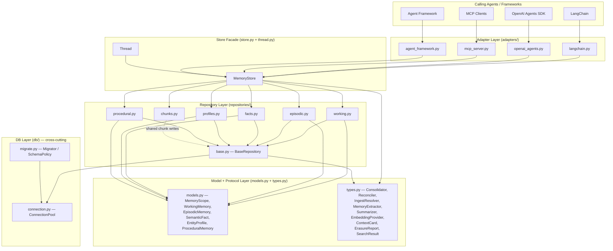

# System Architecture

## 1. Purpose and Scope

This document describes the internal architecture of **agent-memory-sdk**: a governed,
multi-type memory system for AI agents, backed by IBM Db2 LUW with native vector support.

It covers:

- The conceptual layering of the codebase and the responsibilities of each layer.
- The design principles that drove every structural decision, with the concrete technical
  rationale for each.
- A component-responsibility table listing every module and its key roles.
- The technology-stack choices and the codebase-derived reasons for each choice.

This document is self-contained. It does not assume the reader has read any other
project-management document.

---

## 2. Layered Architecture

The codebase is organized into four vertical layers plus a cross-cutting database
infrastructure layer. Agents sit above the entire stack and interact only through the
adapter layer or directly through the `MemoryStore` facade.



**Layer summary**

| Layer | Modules | Role |
|---|---|---|
| Model + Protocol | `models.py`, `types.py` | Value objects, Pydantic schemas, pluggable-protocol interfaces |
| Repository | `repositories/` | Per-type SQL CRUD, vector search, chunking |
| Store facade | `store.py`, `thread.py` | Composition root, lifecycle orchestration, scope enforcement |
| Adapter | `adapters/` | Thin wrappers that satisfy external framework contracts |
| DB (cross-cutting) | `db/connection.py`, `db/migrate.py` | Connection pool, schema migrations |

---

## 3. Design Principles

### 3.1 Normalized Per-Type Tables

The schema uses five dedicated Db2 tables — `working_memory`, `episodic_memory`,
`semantic_facts`, `entity_profiles`, `procedural_memory` — each with its own
`VECTOR(1536,FLOAT32) NOT NULL` column and a matching `VECTOR INDEX … WITH DISTANCE COSINE`.

**Technical rationale.** Db2's DiskANN approximate nearest-neighbour (ANN) vector index
requires a `NOT NULL` `VECTOR` column on the table being indexed. A single polymorphic
table that models multiple memory types with a discriminator column cannot satisfy this
constraint because a row belonging to one type would hold `NULL` in the vector column of
another type. Normalizing into per-type tables ensures every row in every table always
carries a concrete vector, either a real embedding or the zero-vector sentinel written by
the repository layer when chunking has delegated semantic representation to the
`memory_chunks` table.

This choice is explicitly documented in
[`repositories/base.py`](../src/agent_memory_sdk/repositories/base.py) (the `_HAS_SUPERSESSION`
and `_HAS_CONSOLIDATED_AT` guards) and in the migration files: columns added by later
migrations (e.g., `superseded_at` on `semantic_facts` only, `consolidated_at` on
`working_memory` and `episodic_memory` only) confirm that each table has its own
independent schema lifecycle.

### 3.2 Pluggable-Protocol Extensibility

LLM-backed behaviors — consolidation, reconciliation, ingest-time classification,
memory extraction, summarization, and embedding — are each defined as a Python `Protocol`
in [`types.py`](../src/agent_memory_sdk/types.py). Every protocol has a no-op default:
`NoOpConsolidator`, `NoOpReconciler`, `NoOpIngestResolver`, `NoOpMemoryExtractor`,
`NoOpSummarizer`.

**Technical rationale.** The SDK has zero mandatory LLM dependency. When all protocols
are at their no-op defaults, the entire write and read path executes as pure SQL with no
external calls. A caller opts in to LLM-backed behavior by supplying a concrete
implementation at `MemoryStore` construction time:

```python
store = MemoryStore(pool, consolidator=MyLLMConsolidator(), reconciler=MyLLMReconciler())
```

This makes the SDK usable in environments where no LLM is available (tests, edge
deployments, compliance-only workloads) and eliminates vendor lock-in on any specific
LLM provider. The `EmbeddingProvider` protocol follows the same pattern: it is an
injectable `(text: str) -> list[float]` callable, not an import of any specific embedding
library.

### 3.3 Synchronous-by-Default

All SDK operations — including protocol callbacks — execute synchronously on the calling
thread. No background threads, task queues, or event loops are started or required by the
SDK itself.

**Technical rationale.** Synchronous execution is the simplest correct model for a
library: no hidden threading surprises, no `asyncio` / thread-safety complexity in user
code, and no external broker dependency. The trade-off — potentially blocking the hot
write path during a slow LLM consolidation call — is explicitly documented and the
recommended mitigation is also built into the codebase: the `consolidated_at IS NULL`
polling pattern (see `scripts/consolidate_pending.py`) and the `consolidate_every_n`
throttle on `MemoryStore` let callers move expensive callbacks off the write path without
any architectural change to the SDK. The `MemoryStore` docstring (see
[`store.py`](../src/agent_memory_sdk/store.py)) describes this background-worker pattern
in full.

### 3.4 Mandatory Scope Predicates

Every repository method requires a `MemoryScope` with `agent_id` set. The scope is
translated into SQL WHERE-clause predicates by `_scope_predicates()` in
[`repositories/base.py`](../src/agent_memory_sdk/repositories/base.py), which always
emits at least `agent_id = ?`. When `tenant_id`, `user_id`, or `thread_id` are also
provided on the scope, they narrow the predicate further.

**Technical rationale.** Agent isolation is a correctness requirement, not a
convenience. Every `SELECT`, `INSERT`, `UPDATE`, and `DELETE` in the repository layer
carries a scope predicate. This prevents one agent or tenant from reading or modifying
another's memory at the SQL level, not just at an application-logic level. The
`_require_agent_id()` guard at the top of every repository method raises `ValueError`
before any SQL is constructed if `agent_id` is missing, making the invariant fail-fast
and visible. The scope hierarchy is:

```
tenant_id (nullable)  ⊇  agent_id (required)  ⊇  user_id (optional)  ⊇  thread_id (optional)
```

`MemoryScope` is a frozen Pydantic model, so a scope object cannot be mutated after
construction — once passed to a repository call, the isolation predicate it encodes is
immutable for that call's lifetime.

### 3.5 Framework-Agnostic Core with Thin Adapters

The core SDK (`models.py`, `types.py`, `store.py`, `repositories/`, `db/`) has no
dependency on any agent framework. Framework integration is implemented as optional
extras in the `adapters/` directory; each adapter file imports its framework dependency
lazily (only at instantiation time) so the rest of the SDK remains importable even when
the optional extra is not installed.

**Technical rationale.** Agent frameworks evolve rapidly and have incompatible
abstractions. Coupling the memory storage layer to any one framework's interface would
constrain the SDK's use cases and force its version to track the framework's version.
The adapter pattern confines framework-specific code to a single file per framework
(≈100–200 lines each) and allows new integrations to be added without touching the core.
Four adapters are shipped: LangChain (`Db2ChatMessageHistory`, `Db2MemoryStore`), OpenAI
Agents SDK (`Db2Session`), MCP (`remember`/`recall`/`forget`/`list_memories` tools), and
Agent Framework (`MemoryStoreContextProvider`, `MemoryStoreHistoryProvider`).

---

## 4. Component Responsibility Table

| Module | Key Responsibilities |
|---|---|
| [`models.py`](../src/agent_memory_sdk/models.py) | Defines `MemoryScope` (frozen scoping value object) and the five memory-type Pydantic models: `WorkingMemory`, `EpisodicMemory`, `SemanticFact`, `EntityProfile`, `ProceduralMemory`. Each model maps 1-to-1 with a Db2 table. The `_MemoryBase` mixin carries all shared columns: `id`, scope fields, `content`, `metadata`, `embedding`, `confidence`, `content_hash`, timestamps, `version`, `deleted_at`, `consolidated_at`. |
| [`types.py`](../src/agent_memory_sdk/types.py) | Defines all pluggable protocols (`Consolidator`, `Reconciler`, `IngestResolver`, `MemoryExtractor`, `Summarizer`, `EmbeddingProvider`) and their no-op defaults. Also defines result and decision dataclasses: `ContextCard`, `ErasureReport`, `SearchResult`, `Summary`, `IngestDecision`, `SupersedeDecision`. Defines enums: `DistanceMetric`, `SearchMode`, `IngestAction`. |
| [`store.py`](../src/agent_memory_sdk/store.py) | `MemoryStore`: composition root that constructs all five repositories and the optional `ChunkRepository`. Provides the primary write entry point (`remember`), tombstone (`forget`), compliance erasure (`erase_all`), maintenance purge (`purge_expired`), multi-type search (`search`), context card assembly (`get_context_card`), thread-message helpers (`add_messages`, `get_messages`), and backup primitives (`export_scope`, `import_scope`). Orchestrates protocol callbacks (ingest resolver, consolidator). Creates `Thread` instances via `create_thread` / `get_thread`. |
| [`repositories/base.py`](../src/agent_memory_sdk/repositories/base.py) | `BaseRepository[M]`: abstract generic base for all five memory-type repositories. Implements `create`, `get_by_id`, `update`, `forget`, `purge_expired`, `erase_all`, `list_all`, and `search`. Provides shared utilities: `_scope_predicates`, `_require_agent_id`, `_vec_to_str`, `_parse_vector`, `_content_hash`, `_split_chunks`. Implements write-time deduplication (SHA-256 content hash), ORC-2 chunk-write dispatch, Reciprocal Rank Fusion (`_rrf_fuse`) for hybrid search, and optimistic-concurrency `update` (version predicate). |
| [`repositories/working.py`](../src/agent_memory_sdk/repositories/working.py) | `WorkingMemoryRepository`: targets `working_memory`. Disables write-time dedup (`_DEDUP_ON_WRITE = False`) — working memory is an ordered append-only turn log where repeated short utterances are valid distinct rows. Enables `consolidated_at` (`_HAS_CONSOLIDATED_AT = True`) for the background consolidation worker. |
| [`repositories/episodic.py`](../src/agent_memory_sdk/repositories/episodic.py) | `EpisodicMemoryRepository`: targets `episodic_memory`. Enables `consolidated_at` (`_HAS_CONSOLIDATED_AT = True`). Applies standard dedup. Stores summarized session narratives created by the `Consolidator` from working-memory sessions. |
| [`repositories/facts.py`](../src/agent_memory_sdk/repositories/facts.py) | `SemanticFactRepository`: targets `semantic_facts`. Enables supersession (`_HAS_SUPERSESSION = True`), adding `AND superseded_at IS NULL` to all read queries. Provides `supersede(loser_id, winner_id, reason, scope)` used by `MemoryStore.reconcile()`. The `superseded_at IS NOT NULL` state represents AI-managed lifecycle (a fact was contradicted); distinct from `deleted_at IS NOT NULL` (explicit erasure request). |
| [`repositories/profiles.py`](../src/agent_memory_sdk/repositories/profiles.py) | `EntityProfileRepository`: targets `entity_profiles`. Standard dedup enabled. Stores aggregated entity summaries, typically one row per `(agent_id, user_id)` pair, updated by the `Consolidator`. |
| [`repositories/procedural.py`](../src/agent_memory_sdk/repositories/procedural.py) | `ProceduralMemoryRepository`: targets `procedural_memory`. Standard dedup enabled. Stores learned skills and how-to knowledge, typically agent-scoped (`user_id` / `thread_id` often `None`). |
| [`repositories/chunks.py`](../src/agent_memory_sdk/repositories/chunks.py) | `ChunkRepository`: targets the shared `memory_chunks` table. Provides `insert_chunk`, `delete_by_source`, `search_chunks`, `erase_by_scope`, and `list_all`. Used by all five per-type repositories when content exceeds `chunk_threshold`: the parent row stores a zero-vector sentinel and semantic search is delegated to per-chunk embeddings. A single shared table is used because all five parent tables share the same `VECTOR(1536,FLOAT32)/COSINE` shape. |
| [`db/connection.py`](../src/agent_memory_sdk/db/connection.py) | `ConnectionPool`: bounded `queue.Queue`-based pool of `ibm_db` raw connection handles. Pre-opens all connections at startup. `get_connection()` checks out a handle, wraps it in an `ibm_db_dbi.Connection` (DB-API 2.0), yields to the caller, rolls back any uncommitted transaction, and returns the raw handle to the queue. Configurable via `DB2_POOL_SIZE` / `DB2_POOL_TIMEOUT` environment variables. Raises `ConnectionPoolExhausted` (not an indefinite block) when no free connection is available within the timeout. |
| [`db/migrate.py`](../src/agent_memory_sdk/db/migrate.py) | `Migrator`: lightweight stdlib-only SQL migration runner. Applies `.sql` files from `db/migrations/` in lexicographic order, tracking applied versions in `schema_migrations`. Supports two policies: `SchemaPolicy.CREATE_IF_NECESSARY` (default — applies pending migrations) and `SchemaPolicy.REQUIRE_EXISTING` (validates catalog without executing DDL; intended for enterprise deployments where the application user lacks DDL privileges). Raises `SchemaPolicyError` with a complete list of missing objects when validation fails. |
| [`adapters/langchain.py`](../src/agent_memory_sdk/adapters/langchain.py) | `Db2ChatMessageHistory`: implements LangChain's `BaseChatMessageHistory` over `store.working`. `Db2MemoryStore`: implements LangChain's `BaseStore[str, Any]` over `store.facts` and `store.profiles`. Both import `langchain_core` lazily so the SDK remains importable without the extra installed. |
| [`adapters/openai_agents.py`](../src/agent_memory_sdk/adapters/openai_agents.py) | `Db2Session`: implements the OpenAI Agents SDK `Session` protocol. Maps session message storage to `store.working` (current turns) and exposes `recall_episodes()` for cross-session episodic recall. Session-id maps to `MemoryScope.thread_id`; `agent_id` is supplied at construction time. |
| [`adapters/mcp_server.py`](../src/agent_memory_sdk/adapters/mcp_server.py) | Exposes four MCP tools via `create_server()`: `remember` (store any memory type), `recall` (semantic vector search; caller supplies a pre-computed `query_embedding` as a JSON float array), `forget` (soft-delete by id), and `list_memories` (recency-based listing). Runnable as a standalone stdio MCP server (`python -m agent_memory_sdk.adapters.mcp_server`). |
| [`adapters/agent_framework.py`](../src/agent_memory_sdk/adapters/agent_framework.py) | `MemoryStoreContextProvider`: subclasses `agent_framework.ContextProvider`; `before_run()` injects working-memory context and relevant semantic facts via `context.extend_instructions()`; `after_run()` persists the turn via `store.remember()`. `MemoryStoreHistoryProvider`: subclasses `agent_framework.HistoryProvider`; maps `get_messages()` / `save_messages()` onto the working-memory repository. Both classes are constructed once per agent and read all session-specific identifiers from the per-call `state` dict. |
| [`thread.py`](../src/agent_memory_sdk/thread.py) | `Thread`: scope-bound convenience wrapper over `MemoryStore`. Pre-binds a `MemoryScope` (with `thread_id` set) so callers can issue `add_messages`, `get_messages`, `get_summary`, `get_context_card`, `add_memory`, `recall`, and `forget` without passing the scope on every call. Created by `MemoryStore.create_thread()` / `get_thread()`; not intended to be instantiated directly. |
| [`exceptions.py`](../src/agent_memory_sdk/exceptions.py) | `StaleWriteError`: raised by `update()` when the optimistic-concurrency version predicate matches 0 rows (another writer modified the row between the caller's `get_by_id` and their `update` call). `InvalidMetadataFilterError`: raised when a `metadata_filter` dict contains an unrecognized `$`-prefixed operator. `ScopeMismatchError` / `ScopeImportError`: raised by `import_scope()` when an imported record's scope columns do not match the target import scope. `SchemaPolicyError`: raised by `Migrator.validate()` when `REQUIRE_EXISTING` validation fails. |

---

## 5. Technology Stack

### Python 3.10+

**Rationale.** The `match`/`case` statement, `X | Y` union type syntax in annotations,
and `from __future__ import annotations` deferred evaluation are all used or relied on
throughout the codebase. The `requires-python = ">=3.10"` constraint in
[`pyproject.toml`](../pyproject.toml) reflects this minimum. Python 3.10, 3.11, and 3.12
are all listed as supported classifiers, providing a three-version compatibility window.

### Pydantic v2 (`pydantic>=2.13.4`)

**Rationale.** All five memory-type models and `MemoryScope` are Pydantic `BaseModel`
subclasses. Pydantic v2 provides runtime type validation at model construction (e.g., the
`ge=0.0, le=1.0` constraint on `confidence`), `model_dump(mode="json")` for ISO-8601
datetime serialization in `export_scope()`, and frozen model support (`model_config =
{"frozen": True}` on `MemoryScope`). The v2 constraint (`>=2.13.4`) pins to the first
stable v2 release in this project's dependency resolution and avoids the v1 API, which
has incompatible serialization behavior. No Pydantic v1 compatibility shims are used
anywhere in the codebase.

### IBM Db2 LUW with `VECTOR` Type and DiskANN Index

**Rationale.** The `VECTOR(1536,FLOAT32)` column type, the `VECTOR INDEX … WITH DISTANCE
COSINE` DiskANN index, and the `VECTOR_DISTANCE` / `VECTOR_SERIALIZE` SQL functions are
used by the repository layer for all semantic search operations. Db2's DiskANN index
provides sub-linear approximate nearest-neighbour search at query time
(`FETCH FIRST n ROWS ONLY APPROX`), while `FETCH FIRST n ROWS ONLY` (exact mode) is
available as a fallback controlled by the `SearchMode` enum. The `DistanceMetric` enum
documents that the ANN index is built with `COSINE` distance; passing a non-`COSINE`
metric at query time falls back to a full scan (Db2 will not use the index). The
`_vec_to_str()` function in `base.py` inlines vector literals as
`CAST('…' AS VECTOR(dim,FLOAT32))` because binding them via `?` parameters triggers a
`SQL0901N` driver error on Db2 12.1.5 fp0 — a concrete constraint of this specific
database version that is documented in the repository's base module.

### `ibm_db>=3.2.9` Native Driver

**Rationale.** `ibm_db` is IBM's native Python driver for Db2 LUW. It uses ODBC/CLI
keyword-pair connection strings (not JDBC URLs) and auto-downloads a bundled `clidriver`
at install time, eliminating a separate manual client installation for most platforms.
The `ibm_db_dbi` DB-API 2.0 wrapper (included in the same package) uses `?` (qmark)
positional parameter placeholders, which the repository layer targets throughout. The
`ibm_db` package provides no built-in connection pooling; the SDK's `ConnectionPool`
class fills this gap with a bounded `queue.Queue` of pre-opened raw handles. The version
floor (`>=3.2.9`) reflects the minimum tested version for `VECTOR` column support and the
`ibm_db_dbi` behavior relied on by the repository layer.

### hatchling Build Backend

**Rationale.** `hatchling` is the PEP 517/518/660 build backend declared in
[`pyproject.toml`](../pyproject.toml). It provides zero-configuration `src/`-layout
discovery (no `package_dir` mapping needed), first-class editable-install support
without a legacy `setup.py` shim, and built-in version management from a static string.
The choice is documented in the `pyproject.toml` comment: lighter build tree than
`setuptools` for a library of this size, and full compliance with current PEP 517/518/660
standards.

---

*End of document.*
