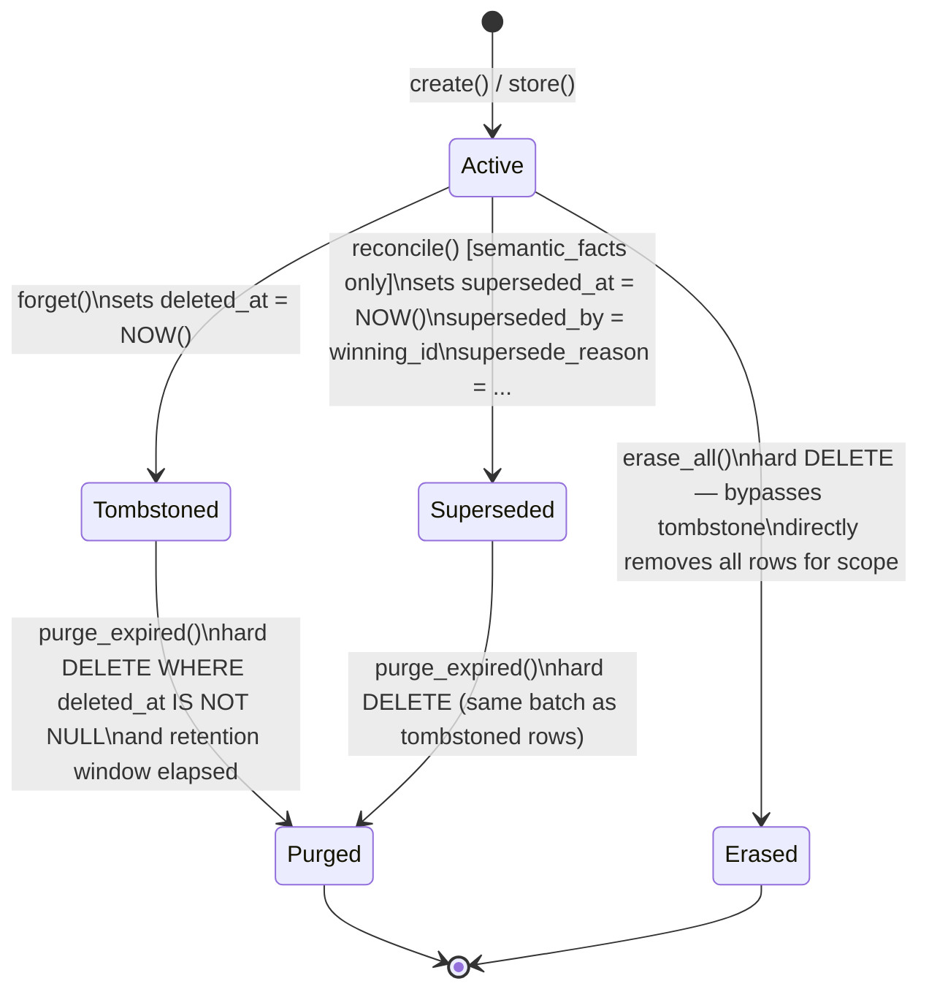

# 02 — Data Architecture

**EPIC-9 · SDD-2**
**Status:** Approved
**Source of truth:** `src/agent_memory_sdk/db/migrations/` (migrations 0001–0007)

---

## Table of Contents

1. [Overview](#1-overview)
2. [Entity-Relationship Diagram](#2-entity-relationship-diagram)
3. [Per-Table Column Dictionary](#3-per-table-column-dictionary)
   - [3.1 schema\_migrations](#31-schema_migrations)
   - [3.2 working\_memory](#32-working_memory)
   - [3.3 episodic\_memory](#33-episodic_memory)
   - [3.4 semantic\_facts](#34-semantic_facts)
   - [3.5 entity\_profiles](#35-entity_profiles)
   - [3.6 procedural\_memory](#36-procedural_memory)
   - [3.7 memory\_chunks](#37-memory_chunks)
4. [Indexing Strategy](#4-indexing-strategy)
5. [Migration History](#5-migration-history)
6. [Data Lifecycle State Diagram](#6-data-lifecycle-state-diagram)

---

## 1. Overview

The agent-memory-sdk manages **7 database tables** under a single schema. The schema is applied via an ordered set of SQL migration files located in `src/agent_memory_sdk/db/migrations/`. The migration runner (`migrate.py`) applies each file exactly once, recording the filename in `schema_migrations` to ensure idempotency.

| Table | Purpose |
|---|---|
| `schema_migrations` | Internal migration-runner bookkeeping; one row per applied migration file |
| `working_memory` | Raw current-session or current-thread turns; short-lived, expires-at-aware |
| `episodic_memory` | Summarized past runs, threads, or events produced by the consolidation pipeline |
| `semantic_facts` | Individual atomic facts extracted from episodic/working memory by the Consolidator |
| `entity_profiles` | Aggregated, merged profiles for users or other entities; typically one row per `(agent_id, user_id)` |
| `procedural_memory` | Learned skills, instruction sets, and how-to knowledge; typically agent-scoped |
| `memory_chunks` | Overlapping text chunks with individual embeddings for long-form content that exceeds the chunking threshold |

The five memory tables (`working_memory`, `episodic_memory`, `semantic_facts`, `entity_profiles`, `procedural_memory`) share a common base schema (scope columns, `content`, `metadata`, `embedding`, lifecycle timestamps, `confidence`, `content_hash`). `memory_chunks` is a satellite table that carries embedded sub-sections of parent rows from any of the five memory tables; it does not duplicate lifecycle columns but replicates the scope columns for pre-filter efficiency.

---

## 2. Entity-Relationship Diagram

The diagram below captures every column as it exists after all seven migrations have been applied. Nullability is indicated by `||` (NOT NULL) vs `o|` / `}o` (nullable) Crow's Foot notation. `memory_chunks.source_id` references the `id` of a row in one of the five memory tables (discriminated by `source_table`); this is an application-level, not a database-level, foreign key.

```mermaid
erDiagram

    schema_migrations {
        VARCHAR_255     version         PK  "NOT NULL"
        TIMESTAMP       applied_at          "NOT NULL DEFAULT CURRENT TIMESTAMP"
    }

    working_memory {
        VARCHAR_36      id              PK  "NOT NULL"
        VARCHAR_128     tenant_id           "NULL"
        VARCHAR_128     agent_id            "NOT NULL"
        VARCHAR_128     user_id             "NULL"
        VARCHAR_128     thread_id           "NULL"
        CLOB_65536      content             "NOT NULL"
        VARCHAR_4096    metadata            "NOT NULL DEFAULT '{}'"
        VECTOR_1536     embedding           "NOT NULL"
        TIMESTAMP       created_at          "NOT NULL DEFAULT CURRENT TIMESTAMP"
        TIMESTAMP       updated_at          "NOT NULL DEFAULT CURRENT TIMESTAMP"
        TIMESTAMP       expires_at          "NULL"
        INTEGER         version             "NOT NULL DEFAULT 1"
        TIMESTAMP       deleted_at          "NULL"
        DOUBLE          confidence          "NOT NULL DEFAULT 1.0"
        VARCHAR_64      content_hash        "NULL"
        TIMESTAMP       consolidated_at     "NULL"
    }

    episodic_memory {
        VARCHAR_36      id              PK  "NOT NULL"
        VARCHAR_128     tenant_id           "NULL"
        VARCHAR_128     agent_id            "NOT NULL"
        VARCHAR_128     user_id             "NULL"
        VARCHAR_128     thread_id           "NULL"
        CLOB_65536      content             "NOT NULL"
        VARCHAR_4096    metadata            "NOT NULL DEFAULT '{}'"
        VECTOR_1536     embedding           "NOT NULL"
        TIMESTAMP       created_at          "NOT NULL DEFAULT CURRENT TIMESTAMP"
        TIMESTAMP       updated_at          "NOT NULL DEFAULT CURRENT TIMESTAMP"
        TIMESTAMP       expires_at          "NULL"
        INTEGER         version             "NOT NULL DEFAULT 1"
        TIMESTAMP       deleted_at          "NULL"
        DOUBLE          confidence          "NOT NULL DEFAULT 1.0"
        VARCHAR_64      content_hash        "NULL"
        TIMESTAMP       consolidated_at     "NULL"
    }

    semantic_facts {
        VARCHAR_36      id              PK  "NOT NULL"
        VARCHAR_128     tenant_id           "NULL"
        VARCHAR_128     agent_id            "NOT NULL"
        VARCHAR_128     user_id             "NULL"
        VARCHAR_128     thread_id           "NULL"
        CLOB_65536      content             "NOT NULL"
        VARCHAR_4096    metadata            "NOT NULL DEFAULT '{}'"
        VECTOR_1536     embedding           "NOT NULL"
        TIMESTAMP       created_at          "NOT NULL DEFAULT CURRENT TIMESTAMP"
        TIMESTAMP       updated_at          "NOT NULL DEFAULT CURRENT TIMESTAMP"
        TIMESTAMP       expires_at          "NULL"
        INTEGER         version             "NOT NULL DEFAULT 1"
        TIMESTAMP       deleted_at          "NULL"
        DOUBLE          confidence          "NOT NULL DEFAULT 1.0"
        VARCHAR_64      content_hash        "NULL"
        VARCHAR_36      superseded_by       "NULL"
        TIMESTAMP       superseded_at       "NULL"
        VARCHAR_255     supersede_reason    "NULL"
    }

    entity_profiles {
        VARCHAR_36      id              PK  "NOT NULL"
        VARCHAR_128     tenant_id           "NULL"
        VARCHAR_128     agent_id            "NOT NULL"
        VARCHAR_128     user_id             "NULL"
        VARCHAR_128     thread_id           "NULL"
        CLOB_65536      content             "NOT NULL"
        VARCHAR_4096    metadata            "NOT NULL DEFAULT '{}'"
        VECTOR_1536     embedding           "NOT NULL"
        TIMESTAMP       created_at          "NOT NULL DEFAULT CURRENT TIMESTAMP"
        TIMESTAMP       updated_at          "NOT NULL DEFAULT CURRENT TIMESTAMP"
        TIMESTAMP       expires_at          "NULL"
        INTEGER         version             "NOT NULL DEFAULT 1"
        TIMESTAMP       deleted_at          "NULL"
        DOUBLE          confidence          "NOT NULL DEFAULT 1.0"
        VARCHAR_64      content_hash        "NULL"
    }

    procedural_memory {
        VARCHAR_36      id              PK  "NOT NULL"
        VARCHAR_128     tenant_id           "NULL"
        VARCHAR_128     agent_id            "NOT NULL"
        VARCHAR_128     user_id             "NULL"
        VARCHAR_128     thread_id           "NULL"
        CLOB_65536      content             "NOT NULL"
        VARCHAR_4096    metadata            "NOT NULL DEFAULT '{}'"
        VECTOR_1536     embedding           "NOT NULL"
        TIMESTAMP       created_at          "NOT NULL DEFAULT CURRENT TIMESTAMP"
        TIMESTAMP       updated_at          "NOT NULL DEFAULT CURRENT TIMESTAMP"
        TIMESTAMP       expires_at          "NULL"
        INTEGER         version             "NOT NULL DEFAULT 1"
        TIMESTAMP       deleted_at          "NULL"
        DOUBLE          confidence          "NOT NULL DEFAULT 1.0"
        VARCHAR_64      content_hash        "NULL"
    }

    memory_chunks {
        VARCHAR_36      id              PK  "NOT NULL"
        VARCHAR_64      source_table        "NOT NULL"
        VARCHAR_64      source_id           "NOT NULL"
        INTEGER         chunk_index         "NOT NULL"
        CLOB_4096       chunk_text          "NOT NULL"
        VECTOR_1536     embedding           "NOT NULL"
        VARCHAR_128     tenant_id           "NULL"
        VARCHAR_128     agent_id            "NOT NULL"
        VARCHAR_128     user_id             "NULL"
        VARCHAR_128     thread_id           "NULL"
        TIMESTAMP       created_at          "NOT NULL DEFAULT CURRENT TIMESTAMP"
    }

    working_memory    ||--o{ memory_chunks : "source_id (app-level)"
    episodic_memory   ||--o{ memory_chunks : "source_id (app-level)"
    semantic_facts    ||--o{ memory_chunks : "source_id (app-level)"
    entity_profiles   ||--o{ memory_chunks : "source_id (app-level)"
    procedural_memory ||--o{ memory_chunks : "source_id (app-level)"
    semantic_facts    }o--o| semantic_facts : "superseded_by → id"
```

---

## 3. Per-Table Column Dictionary

All column information is sourced exclusively from the migration files in `src/agent_memory_sdk/db/migrations/` and cross-referenced against `src/agent_memory_sdk/models.py`.

---

### 3.1 `schema_migrations`

Created by: `0001_schema_migrations.sql`

| Column | Type | Nullable | Default | Purpose |
|---|---|---|---|---|
| `version` | `VARCHAR(255)` | NOT NULL | — | Primary key. The filename of the applied migration (e.g. `0001_schema_migrations.sql`). |
| `applied_at` | `TIMESTAMP` | NOT NULL | `CURRENT TIMESTAMP` | Wall-clock time when the migration runner committed the migration. |

**Constraints:** `pk_schema_migrations PRIMARY KEY (version)`

---

### 3.2 `working_memory`

Created by: `0002_memory_tables.sql`; extended by `0003`, `0005`.

Stores raw current-session or current-thread agent turns. Records are typically short-lived and carry an `expires_at` timestamp. The consolidation pipeline reads from this table, then marks rows with `consolidated_at`.

| Column | Type | Nullable | Default | Purpose |
|---|---|---|---|---|
| `id` | `VARCHAR(36)` | NOT NULL | — | Primary key. UUID4 generated on the Python side by `_new_uuid()`. |
| `tenant_id` | `VARCHAR(128)` | NULL | — | Multi-tenancy discriminator. NULL in single-tenant deployments. |
| `agent_id` | `VARCHAR(128)` | NOT NULL | — | Owning agent identifier. Required on every row. |
| `user_id` | `VARCHAR(128)` | NULL | — | User identifier within the agent's scope. NULL when not user-scoped. |
| `thread_id` | `VARCHAR(128)` | NULL | — | Conversation thread identifier. NULL when not thread-scoped. |
| `content` | `CLOB(65536)` | NOT NULL | — | The memory content (raw turn text). Up to 64 KB. |
| `metadata` | `VARCHAR(4096)` | NOT NULL | `'{}'` | JSON object for caller-supplied tags, model name, run-id, etc. Up to 4 KB. |
| `embedding` | `VECTOR(1536, FLOAT32)` | NOT NULL | — | 1536-dimensional float32 embedding vector. Supplied by the application layer on every INSERT; never relies on a DB-side default. |
| `created_at` | `TIMESTAMP` | NOT NULL | `CURRENT TIMESTAMP` | Row creation time. |
| `updated_at` | `TIMESTAMP` | NOT NULL | `CURRENT TIMESTAMP` | Last update time. Maintained by the repository layer on every UPDATE. |
| `expires_at` | `TIMESTAMP` | NULL | — | Optional TTL expiry. NULL means the row does not expire automatically. |
| `version` | `INTEGER` | NOT NULL | `1` | Optimistic concurrency counter. Incremented on every UPDATE by the repository. |
| `deleted_at` | `TIMESTAMP` | NULL | — | Soft-delete tombstone. Set by `forget()`; NULL means the row is live. |
| `confidence` | `DOUBLE` | NOT NULL | `1.0` | Grounding-certainty score in [0.0, 1.0]. `1.0` = directly observed. Added by migration 0003. |
| `content_hash` | `VARCHAR(64)` | NULL | — | Hex SHA-256 of normalised content. Used for write-time deduplication. NULL for rows predating migration 0003. |
| `consolidated_at` | `TIMESTAMP` | NULL | — | Timestamp set when a consolidation worker claims this row. NULL = not yet processed. Added by migration 0005. |

**Constraints:** `pk_working_memory PRIMARY KEY (id)`

---

### 3.3 `episodic_memory`

Created by: `0002_memory_tables.sql`; extended by `0003`, `0005`.

Stores summarized records of past runs, threads, or events. Produced by the consolidation pipeline from `working_memory` rows. Shares the same base schema as `working_memory` and also participates in the consolidation pipeline via `consolidated_at`.

| Column | Type | Nullable | Default | Purpose |
|---|---|---|---|---|
| `id` | `VARCHAR(36)` | NOT NULL | — | Primary key. UUID4. |
| `tenant_id` | `VARCHAR(128)` | NULL | — | Multi-tenancy discriminator. |
| `agent_id` | `VARCHAR(128)` | NOT NULL | — | Owning agent identifier. |
| `user_id` | `VARCHAR(128)` | NULL | — | User identifier within the agent's scope. |
| `thread_id` | `VARCHAR(128)` | NULL | — | Conversation thread identifier. |
| `content` | `CLOB(65536)` | NOT NULL | — | Summarized episode narrative. Up to 64 KB. |
| `metadata` | `VARCHAR(4096)` | NOT NULL | `'{}'` | JSON object (e.g. `{"source_thread": "...", "summary_model": "gpt-4o"}`). |
| `embedding` | `VECTOR(1536, FLOAT32)` | NOT NULL | — | 1536-dimensional float32 embedding. Supplied by the application layer. |
| `created_at` | `TIMESTAMP` | NOT NULL | `CURRENT TIMESTAMP` | Row creation time. |
| `updated_at` | `TIMESTAMP` | NOT NULL | `CURRENT TIMESTAMP` | Last update time. |
| `expires_at` | `TIMESTAMP` | NULL | — | Optional TTL expiry. |
| `version` | `INTEGER` | NOT NULL | `1` | Optimistic concurrency counter. |
| `deleted_at` | `TIMESTAMP` | NULL | — | Soft-delete tombstone. |
| `confidence` | `DOUBLE` | NOT NULL | `1.0` | Certainty score [0.0, 1.0]. Added by migration 0003. |
| `content_hash` | `VARCHAR(64)` | NULL | — | Hex SHA-256 of normalised content. Added by migration 0003. |
| `consolidated_at` | `TIMESTAMP` | NULL | — | Consolidation claim timestamp. NULL = not yet processed. Added by migration 0005. |

**Constraints:** `pk_episodic_memory PRIMARY KEY (id)`

---

### 3.4 `semantic_facts`

Created by: `0002_memory_tables.sql`; extended by `0003`, `0004`.

Stores individual atomic facts extracted from episodic or working memory (e.g. _"User prefers Python over Java"_). The only table with supersession columns, which model AI-managed fact contradiction as a distinct, auditable lifecycle event separate from operator-driven `deleted_at` tombstoning.

| Column | Type | Nullable | Default | Purpose |
|---|---|---|---|---|
| `id` | `VARCHAR(36)` | NOT NULL | — | Primary key. UUID4. |
| `tenant_id` | `VARCHAR(128)` | NULL | — | Multi-tenancy discriminator. |
| `agent_id` | `VARCHAR(128)` | NOT NULL | — | Owning agent identifier. |
| `user_id` | `VARCHAR(128)` | NULL | — | User identifier. |
| `thread_id` | `VARCHAR(128)` | NULL | — | Thread identifier. |
| `content` | `CLOB(65536)` | NOT NULL | — | The factual statement. Up to 64 KB. |
| `metadata` | `VARCHAR(4096)` | NOT NULL | `'{}'` | JSON object (e.g. `{"source": "episode-xyz"}`). |
| `embedding` | `VECTOR(1536, FLOAT32)` | NOT NULL | — | 1536-dimensional float32 embedding. Supplied by the application layer. |
| `created_at` | `TIMESTAMP` | NOT NULL | `CURRENT TIMESTAMP` | Row creation time. |
| `updated_at` | `TIMESTAMP` | NOT NULL | `CURRENT TIMESTAMP` | Last update time. |
| `expires_at` | `TIMESTAMP` | NULL | — | Optional TTL expiry. |
| `version` | `INTEGER` | NOT NULL | `1` | Optimistic concurrency counter. |
| `deleted_at` | `TIMESTAMP` | NULL | — | Soft-delete tombstone set by `forget()`. |
| `confidence` | `DOUBLE` | NOT NULL | `1.0` | Certainty score [0.0, 1.0]. Added by migration 0003. |
| `content_hash` | `VARCHAR(64)` | NULL | — | Hex SHA-256 of normalised content. Added by migration 0003. |
| `superseded_by` | `VARCHAR(36)` | NULL | — | Application-level reference to the `id` of the winning row. No DB-level FK. NULL = fact is still live. Added by migration 0004. |
| `superseded_at` | `TIMESTAMP` | NULL | — | Timestamp when `reconcile()` soft-superseded this row. NULL = fact is still live. Added by migration 0004. |
| `supersede_reason` | `VARCHAR(255)` | NULL | — | Human-readable reason string set by the Reconciler (e.g. _"contradicts: user now prefers light mode"_). Added by migration 0004. |

**Constraints:** `pk_semantic_facts PRIMARY KEY (id)`

**Governance note:** `superseded_at IS NOT NULL` means the AI determined this fact was contradicted. `deleted_at IS NOT NULL` means an operator or user requested forgetting. These are deliberately distinct audit paths; both exclude the row from normal reads without hard-deleting it.

---

### 3.5 `entity_profiles`

Created by: `0002_memory_tables.sql`; extended by `0003`.

Stores aggregated, merged profiles for users or other entities. Typically one row per `(agent_id, user_id)`. Updated in-place by the Consolidator rather than superseded, because the design treats profiles as a single merged aggregate rather than a set of competing individual claims.

| Column | Type | Nullable | Default | Purpose |
|---|---|---|---|---|
| `id` | `VARCHAR(36)` | NOT NULL | — | Primary key. UUID4. |
| `tenant_id` | `VARCHAR(128)` | NULL | — | Multi-tenancy discriminator. |
| `agent_id` | `VARCHAR(128)` | NOT NULL | — | Owning agent identifier. |
| `user_id` | `VARCHAR(128)` | NULL | — | User identifier (expected to be set on most profile rows). |
| `thread_id` | `VARCHAR(128)` | NULL | — | Thread identifier. Typically NULL for profiles. |
| `content` | `CLOB(65536)` | NOT NULL | — | Dense narrative summary of the entity. Up to 64 KB. |
| `metadata` | `VARCHAR(4096)` | NOT NULL | `'{}'` | JSON object (e.g. `{"last_updated_from": "episode-xyz"}`). |
| `embedding` | `VECTOR(1536, FLOAT32)` | NOT NULL | — | 1536-dimensional float32 embedding. Supplied by the application layer. |
| `created_at` | `TIMESTAMP` | NOT NULL | `CURRENT TIMESTAMP` | Row creation time. |
| `updated_at` | `TIMESTAMP` | NOT NULL | `CURRENT TIMESTAMP` | Last update time. |
| `expires_at` | `TIMESTAMP` | NULL | — | Optional TTL expiry. |
| `version` | `INTEGER` | NOT NULL | `1` | Optimistic concurrency counter. |
| `deleted_at` | `TIMESTAMP` | NULL | — | Soft-delete tombstone. |
| `confidence` | `DOUBLE` | NOT NULL | `1.0` | Certainty score [0.0, 1.0]. Added by migration 0003. |
| `content_hash` | `VARCHAR(64)` | NULL | — | Hex SHA-256 of normalised content. Added by migration 0003. |

**Constraints:** `pk_entity_profiles PRIMARY KEY (id)`

---

### 3.6 `procedural_memory`

Created by: `0002_memory_tables.sql`; extended by `0003`.

Stores learned skills, instruction sets, and how-to knowledge. Typically agent-scoped: `user_id` and `thread_id` are nullable and often omitted. Skills are updated in-place via `update()` with optimistic concurrency, not superseded.

| Column | Type | Nullable | Default | Purpose |
|---|---|---|---|---|
| `id` | `VARCHAR(36)` | NOT NULL | — | Primary key. UUID4. |
| `tenant_id` | `VARCHAR(128)` | NULL | — | Multi-tenancy discriminator. |
| `agent_id` | `VARCHAR(128)` | NOT NULL | — | Owning agent identifier. |
| `user_id` | `VARCHAR(128)` | NULL | — | Typically NULL; skills are agent-scoped. |
| `thread_id` | `VARCHAR(128)` | NULL | — | Typically NULL; skills are agent-scoped. |
| `content` | `CLOB(65536)` | NOT NULL | — | Skill or instruction text. Up to 64 KB. |
| `metadata` | `VARCHAR(4096)` | NOT NULL | `'{}'` | JSON object (e.g. `{"skill": "debugging"}`). |
| `embedding` | `VECTOR(1536, FLOAT32)` | NOT NULL | — | 1536-dimensional float32 embedding. Supplied by the application layer. |
| `created_at` | `TIMESTAMP` | NOT NULL | `CURRENT TIMESTAMP` | Row creation time. |
| `updated_at` | `TIMESTAMP` | NOT NULL | `CURRENT TIMESTAMP` | Last update time. |
| `expires_at` | `TIMESTAMP` | NULL | — | Optional TTL expiry. |
| `version` | `INTEGER` | NOT NULL | `1` | Optimistic concurrency counter. |
| `deleted_at` | `TIMESTAMP` | NULL | — | Soft-delete tombstone. |
| `confidence` | `DOUBLE` | NOT NULL | `1.0` | Certainty score [0.0, 1.0]. Added by migration 0003. |
| `content_hash` | `VARCHAR(64)` | NULL | — | Hex SHA-256 of normalised content. Added by migration 0003. |

**Constraints:** `pk_procedural_memory PRIMARY KEY (id)`

---

### 3.7 `memory_chunks`

Created by: `0006_memory_chunks.sql`; `source_id` widened by `0007_widen_chunks_source_id.sql`.

A single shared table for overlapping text chunks produced when a memory row's content exceeds the chunking threshold (default 2000 characters). Each chunk receives its own embedding. The `source_table` column discriminates which of the five memory tables the parent row belongs to. Scope columns are replicated from the parent row to allow pre-filtering by scope before the vector distance ranking step.

| Column | Type | Nullable | Default | Purpose |
|---|---|---|---|---|
| `id` | `VARCHAR(36)` | NOT NULL | — | Primary key. UUID4. |
| `source_table` | `VARCHAR(64)` | NOT NULL | — | Discriminator naming the parent memory table (e.g. `working_memory`, `semantic_facts`). |
| `source_id` | `VARCHAR(64)` | NOT NULL | — | Application-level reference to `id` in the table named by `source_table`. Widened from `VARCHAR(36)` to `VARCHAR(64)` in migration 0007 to accommodate prefixed test identifiers. |
| `chunk_index` | `INTEGER` | NOT NULL | — | Zero-based ordinal position of this chunk within the parent row's content. |
| `chunk_text` | `CLOB(4096)` | NOT NULL | — | The chunk's text content (up to 4 KB). |
| `embedding` | `VECTOR(1536, FLOAT32)` | NOT NULL | — | 1536-dimensional float32 embedding for this chunk. Supplied by the application layer. |
| `tenant_id` | `VARCHAR(128)` | NULL | — | Replicated from parent row. Multi-tenancy discriminator. |
| `agent_id` | `VARCHAR(128)` | NOT NULL | — | Replicated from parent row. Owning agent identifier. |
| `user_id` | `VARCHAR(128)` | NULL | — | Replicated from parent row. |
| `thread_id` | `VARCHAR(128)` | NULL | — | Replicated from parent row. |
| `created_at` | `TIMESTAMP` | NOT NULL | `CURRENT TIMESTAMP` | Row creation time. |

**Constraints:** `pk_memory_chunks PRIMARY KEY (id)`

---

## 4. Indexing Strategy

### Distance Metric

All six vector indexes use **COSINE** distance. The rationale from `0002_memory_tables.sql` is: all five memory tables and the chunks table store natural-language text whose embeddings are typically L2-normalised. For L2-normalised vectors, EUCLIDEAN and DOT distance rankings are identical to COSINE. Using a single metric across all tables eliminates per-type metric dispatch in query code and aligns with the recommendation for text embeddings where semantic orientation matters more than vector magnitude.

---

### Vector Indexes

| Index name | Table | Column | Distance | Notes |
|---|---|---|---|---|
| `ix_working_memory_embedding` | `working_memory` | `embedding` | COSINE | ANN semantic search over raw session turns |
| `ix_episodic_memory_embedding` | `episodic_memory` | `embedding` | COSINE | ANN semantic search over episode summaries |
| `ix_semantic_facts_embedding` | `semantic_facts` | `embedding` | COSINE | ANN semantic search over atomic facts |
| `ix_entity_profiles_embedding` | `entity_profiles` | `embedding` | COSINE | ANN semantic search over entity profile summaries |
| `ix_procedural_memory_embedding` | `procedural_memory` | `embedding` | COSINE | ANN semantic search over skill/instruction text |
| `ix_memory_chunks_embedding` | `memory_chunks` | `embedding` | COSINE | ANN chunk-level semantic search; single index services all five parent memory types |

The `embedding` column on all tables is declared `NOT NULL`. Rows with a NULL embedding would be silently skipped by the ANN index, degrading recall. The application layer always supplies an explicit vector on every INSERT — a real embedding or a zero-vector sentinel for long-form rows that have been chunked.

---

### Scope Indexes (composite, B-tree)

These indexes pre-filter results by `(agent_id, tenant_id, user_id, thread_id)` before the vector distance ranking step. All queries in the SDK filter by scope before applying vector distance ranking.

| Index name | Table | Columns |
|---|---|---|
| `ix_working_memory_scope` | `working_memory` | `agent_id, tenant_id, user_id, thread_id` |
| `ix_episodic_memory_scope` | `episodic_memory` | `agent_id, tenant_id, user_id, thread_id` |
| `ix_semantic_facts_scope` | `semantic_facts` | `agent_id, tenant_id, user_id, thread_id` |
| `ix_entity_profiles_scope` | `entity_profiles` | `agent_id, tenant_id, user_id, thread_id` |
| `ix_procedural_memory_scope` | `procedural_memory` | `agent_id, tenant_id, user_id, thread_id` |
| `ix_memory_chunks_scope` | `memory_chunks` | `agent_id, tenant_id, user_id, thread_id` |

---

### Agent Indexes (single-column, B-tree)

Fast single-agent lookups used when no other scope column is specified.

| Index name | Table | Column |
|---|---|---|
| `ix_working_memory_agent` | `working_memory` | `agent_id` |
| `ix_episodic_memory_agent` | `episodic_memory` | `agent_id` |
| `ix_semantic_facts_agent` | `semantic_facts` | `agent_id` |
| `ix_entity_profiles_agent` | `entity_profiles` | `agent_id` |
| `ix_procedural_memory_agent` | `procedural_memory` | `agent_id` |

---

### TTL / Expiry Indexes

Plain (non-partial) indexes on `expires_at`. Db2 12.1 does not support partial (filtered) indexes (`CREATE INDEX ... WHERE`). The `WHERE expires_at IS NOT NULL` predicate that would make these partial indexes was intentionally omitted for compatibility. The small index overhead from NULL rows is negligible given typical cardinality.

| Index name | Table | Column |
|---|---|---|
| `ix_working_memory_expires` | `working_memory` | `expires_at` |
| `ix_episodic_memory_expires` | `episodic_memory` | `expires_at` |
| `ix_semantic_facts_expires` | `semantic_facts` | `expires_at` |
| `ix_entity_profiles_expires` | `entity_profiles` | `expires_at` |
| `ix_procedural_memory_expires` | `procedural_memory` | `expires_at` |

---

### Content-Hash Indexes

Composite on `(agent_id, content_hash)`. Used by `BaseRepository.create()` for write-time deduplication: if a non-deleted row with the same `(agent_id, content_hash)` already exists, `create()` returns that row instead of inserting a duplicate. Added by migration 0003.

| Index name | Table | Columns |
|---|---|---|
| `ix_working_memory_content_hash` | `working_memory` | `agent_id, content_hash` |
| `ix_episodic_memory_content_hash` | `episodic_memory` | `agent_id, content_hash` |
| `ix_semantic_facts_content_hash` | `semantic_facts` | `agent_id, content_hash` |
| `ix_entity_profiles_content_hash` | `entity_profiles` | `agent_id, content_hash` |
| `ix_procedural_memory_content_hash` | `procedural_memory` | `agent_id, content_hash` |

---

### Consolidation Index

Composite on `(agent_id, consolidated_at)`. Enables the consolidation worker's eligibility scan (`WHERE agent_id = ? AND consolidated_at IS NULL`) to use an index range scan rather than a full table scan. Added by migration 0005.

| Index name | Table | Columns |
|---|---|---|
| `ix_working_memory_consolidated_at` | `working_memory` | `agent_id, consolidated_at` |
| `ix_episodic_memory_consolidated_at` | `episodic_memory` | `agent_id, consolidated_at` |

---

### Supersession Index

Composite on `(agent_id, superseded_by)`. Supports listing all rows superseded by a given winning fact and chain-of-supersession audit queries. Added by migration 0004; applies to `semantic_facts` only.

| Index name | Table | Columns |
|---|---|---|
| `ix_semantic_facts_superseded_by` | `semantic_facts` | `agent_id, superseded_by` |

---

### Parent Lookup Index (memory_chunks)

Enables the resolver to fetch all chunks for a known parent row in one seek-scan, and allows chunk-search queries to filter by agent scope before hitting the vector index.

| Index name | Table | Columns |
|---|---|---|
| `ix_memory_chunks_parent` | `memory_chunks` | `agent_id, source_table, source_id` |

---

## 5. Migration History

All 7 migrations in application order. Each file is idempotent with respect to `schema_migrations`: the runner skips a file whose `version` already exists in the table. All changes are additive (new tables, new columns, new indexes) except migration 0007, which widens an existing column's length.

| # | Filename | Purpose | Change type |
|---|---|---|---|
| 0001 | `0001_schema_migrations.sql` | Creates the `schema_migrations` bookkeeping table with `version` (PK) and `applied_at` columns. Must exist before any other migration runs. | Additive — new table |
| 0002 | `0002_memory_tables.sql` | Creates all five memory tables (`working_memory`, `episodic_memory`, `semantic_facts`, `entity_profiles`, `procedural_memory`) with base columns, 5 vector indexes (COSINE), 5 scope composite indexes, 5 agent indexes, and 5 expires indexes. | Additive — 5 new tables, 20 new indexes |
| 0003 | `0003_confidence_and_content_hash.sql` | Adds `confidence DOUBLE NOT NULL DEFAULT 1.0` and `content_hash VARCHAR(64) NULL` to all five memory tables. Adds 5 composite `(agent_id, content_hash)` indexes for write-time deduplication. | Additive — 10 new columns, 5 new indexes |
| 0004 | `0004_supersession.sql` | Adds `superseded_by VARCHAR(36)`, `superseded_at TIMESTAMP`, and `supersede_reason VARCHAR(255)` to `semantic_facts` only. Adds composite `(agent_id, superseded_by)` index for chain-of-supersession queries. Applies to `semantic_facts` exclusively because only atomic facts can logically contradict each other within a scope. | Additive — 3 new columns, 1 new index |
| 0005 | `0005_consolidated_at.sql` | Adds `consolidated_at TIMESTAMP NULL` to `working_memory` and `episodic_memory` — the two tables that feed the consolidation pipeline. Adds composite `(agent_id, consolidated_at)` index on each. Replaces the prior `metadata.consolidated` JSON flag approach. | Additive — 2 new columns, 2 new indexes |
| 0006 | `0006_memory_chunks.sql` | Creates the `memory_chunks` table with `source_table`, `source_id` (initially `VARCHAR(36)`), `chunk_index`, `chunk_text`, `embedding`, scope columns, and `created_at`. Adds 1 vector index (COSINE), 1 parent lookup index, and 1 scope index. | Additive — 1 new table, 3 new indexes |
| 0007 | `0007_widen_chunks_source_id.sql` | Widens `memory_chunks.source_id` from `VARCHAR(36)` to `VARCHAR(64)` via `ALTER TABLE ... ALTER COLUMN ... SET DATA TYPE` to accommodate prefixed test identifiers and any future short-prefix application identifiers. | Column modification — 1 column widened |

---

## 6. Data Lifecycle State Diagram

The diagram below maps each SDK operation to the state transition it produces. Two parallel concerns govern row visibility:

- **Operator/user lifecycle** — `forget()` tombstones; `purge_expired()` hard-deletes tombstoned rows after their retention window.
- **AI-managed lifecycle** — `reconcile()` soft-supersedes `semantic_facts` when a newer fact contradicts an older one. This is a distinct path from tombstoning; superseded rows are invisible to normal reads but remain in the database for audit purposes.
- **Emergency erasure** — `erase_all()` hard-deletes all rows for a scope immediately, bypassing the tombstone step entirely.

### State definitions

| State | Meaning | Row condition |
|---|---|---|
| **Active** | Row is visible to normal reads and vector search | `deleted_at IS NULL` AND (`superseded_at IS NULL` OR table ≠ `semantic_facts`) |
| **Tombstoned** | Soft-deleted; excluded from reads but retained for audit/retention-window purposes | `deleted_at IS NOT NULL` |
| **Superseded** | Fact was contradicted by a newer fact (AI-managed); excluded from reads but retained for audit | `superseded_at IS NOT NULL` (`semantic_facts` only) |
| **Purged** | Hard-deleted by `purge_expired()` after tombstone or supersession; no longer exists in the database | Row is absent |
| **Erased** | Hard-deleted immediately by `erase_all()` without going through tombstoning; no longer exists in the database | Row is absent |

### Operation summary

| Operation | Mechanism | Tables affected |
|---|---|---|
| `forget()` | Sets `deleted_at = NOW()` (soft delete / tombstone) | All five memory tables |
| `purge_expired()` | Hard `DELETE` of rows where `deleted_at IS NOT NULL` and retention window elapsed | All five memory tables |
| `reconcile()` | Sets `superseded_at`, `superseded_by`, `supersede_reason` on the losing row | `semantic_facts` only |
| `erase_all()` | Hard `DELETE` of all rows for a scope — directly, without setting `deleted_at` first | All five memory tables |
