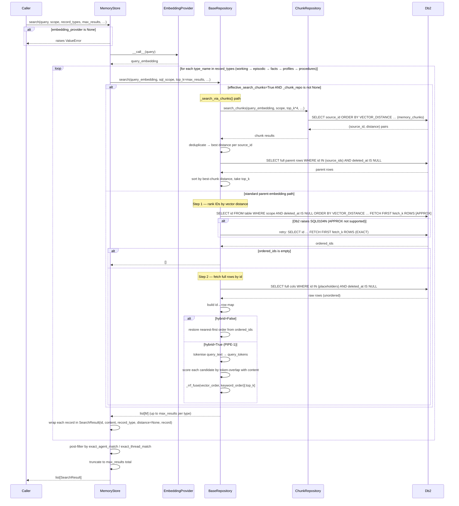
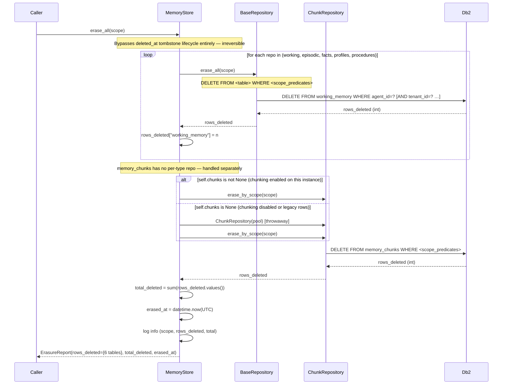
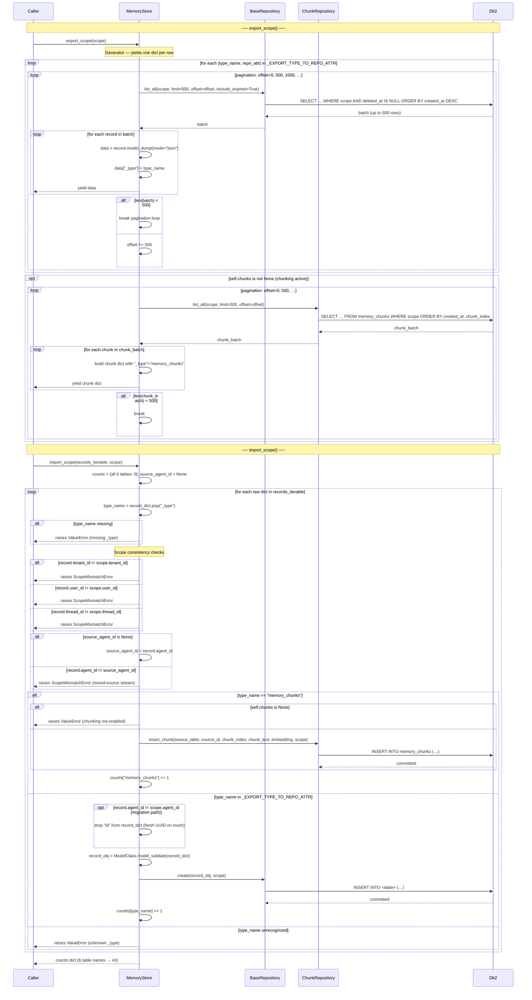
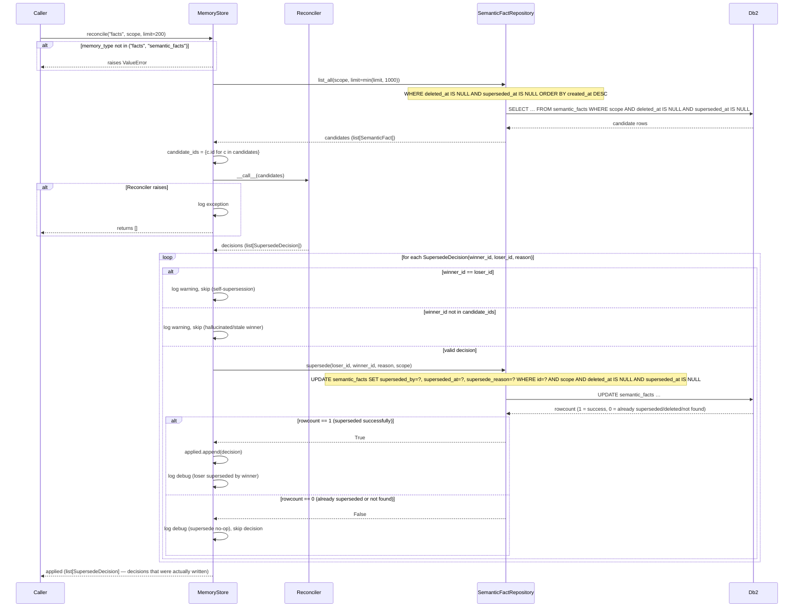

# 04 — Sequence Flows

**EPIC-9 · SDD-4**

Five Mermaid sequence diagrams for the core `MemoryStore` operations. Every
`alt`/`opt` block is grounded in the actual conditional branches present in
[`store.py`](../../src/agent_memory_sdk/store.py),
[`repositories/base.py`](../../src/agent_memory_sdk/repositories/base.py),
[`repositories/chunks.py`](../../src/agent_memory_sdk/repositories/chunks.py), and
[`repositories/facts.py`](../../src/agent_memory_sdk/repositories/facts.py).

---

## 1. `remember()` — write path

`remember()` is the single write entry point for all five memory types. It
dispatches to the correct repository via `_MODEL_TO_REPO_ATTR`, optionally runs
the PIPE-2 `IngestResolver` pipeline before writing, applies the ORC-2 chunking
gate inside `BaseRepository.create()`, and finally triggers the Step-4
`Consolidator` for working/episodic writes. The diagram below traces every
conditional branch in `MemoryStore.remember()`, `_resolve_and_act()`, and
`BaseRepository.create()`.

Key branch conditions (cross-checked against the source):

* **IngestResolver gate** — skipped entirely when the configured resolver is the
  default `NoOpIngestResolver`; the similarity `search()` round-trip is never
  issued in that case (`store.py:512-517`).
* **Embedding for resolver** — `_candidate_embedding()` uses `record.embedding`
  if already set; falls back to `_embedding_provider`; returns `[]` (no search)
  when neither is available (`store.py:613-635`).
* **IngestDecision branches** — `ADD` → `create()`, `UPDATE` → `get_by_id()`
  then `update()` (with fallback to `ADD` if `target_id` is `None` or not
  found), `DELETE` → `forget()` on `target_id`, `NOOP` → nothing written
  (`store.py:570-611`).
* **Chunking gate** — inside `BaseRepository.create()`: fires only when
  `_chunk_repo is not None` AND `_embedding_provider is not None` AND
  `len(content) > _chunk_threshold`; parent row receives a zero-vector sentinel
  and chunk rows are written after the parent `INSERT`
  (`repositories/base.py:954-1027`).
* **Consolidator gate** — fires only when `did_add is True` AND `repo_attr in
  ("working", "episodic")` AND `_should_consolidate(scope)` returns `True`
  (`store.py:521-522`). Each derived record from the consolidator is routed back
  through the appropriate repo's `create()` (`store.py:677-696`).

```mermaid
sequenceDiagram
    participant Caller
    participant MemoryStore
    participant IngestResolver
    participant BaseRepository
    participant Db2
    participant EmbeddingProvider
    participant Consolidator

    Caller->>MemoryStore: remember(record, scope)
    MemoryStore->>MemoryStore: resolve repo from type(record)

    opt ingest_resolver is NOT NoOpIngestResolver
        MemoryStore->>MemoryStore: _resolve_and_act(repo, record, scope)

        alt record.embedding already set
            MemoryStore->>MemoryStore: use record.embedding as candidate_embedding
        else embedding_provider configured
            MemoryStore->>EmbeddingProvider: __call__(record.content)
            EmbeddingProvider-->>MemoryStore: candidate_embedding
        else no embedding available
            MemoryStore->>MemoryStore: candidate_embedding = [] (skip search)
        end

        opt candidate_embedding is non-empty
            MemoryStore->>BaseRepository: search(candidate_embedding, scope, top_k=resolver_k)
            BaseRepository->>Db2: SELECT id ORDER BY VECTOR_DISTANCE … FETCH FIRST resolver_k ROWS
            Db2-->>BaseRepository: ordered_ids
            BaseRepository->>Db2: SELECT full rows WHERE id IN (…)
            Db2-->>BaseRepository: rows
            BaseRepository-->>MemoryStore: similar records
            MemoryStore->>MemoryStore: pair each result with cosine_distance → similar list
        end

        MemoryStore->>IngestResolver: __call__(candidate, similar)
        IngestResolver-->>MemoryStore: IngestDecision(action, target_id, reason)

        alt decision.action == ADD
            MemoryStore->>BaseRepository: create(record, scope)
            Note over MemoryStore: did_add = True
        else decision.action == UPDATE
            alt target_id is None
                MemoryStore->>MemoryStore: log warning → fallback to ADD
                MemoryStore->>BaseRepository: create(record, scope)
                Note over MemoryStore: did_add = True
            else target found via get_by_id
                MemoryStore->>BaseRepository: get_by_id(target_id, scope)
                BaseRepository->>Db2: SELECT … WHERE id=? AND deleted_at IS NULL
                Db2-->>BaseRepository: target row (or None)
                alt target row is None
                    MemoryStore->>MemoryStore: log warning → fallback to ADD
                    MemoryStore->>BaseRepository: create(record, scope)
                    Note over MemoryStore: did_add = True
                else target found
                    MemoryStore->>MemoryStore: copy content/metadata/embedding/confidence onto target
                    MemoryStore->>BaseRepository: update(target, scope)
                    BaseRepository->>Db2: UPDATE … SET … WHERE id=? AND version=?
                    Db2-->>BaseRepository: rowcount
                    BaseRepository-->>MemoryStore: updated record
                    Note over MemoryStore: did_add = False
                end
            end
        else decision.action == DELETE
            alt target_id provided
                MemoryStore->>BaseRepository: forget(target_id, scope)
                BaseRepository->>Db2: UPDATE SET deleted_at=? WHERE id=? AND deleted_at IS NULL
                Db2-->>BaseRepository: rowcount
                BaseRepository-->>MemoryStore: ok (bool)
            else target_id is None
                MemoryStore->>MemoryStore: log warning, nothing forgotten
            end
            Note over MemoryStore: did_add = False; candidate not written
        else decision.action == NOOP
            Note over MemoryStore: did_add = False; nothing written
        end
    end

    opt ingest_resolver IS NoOpIngestResolver (fast path)
        MemoryStore->>BaseRepository: create(record, scope)
        Note over MemoryStore: did_add = True
    end

    Note over BaseRepository: Inside create() — ORC-2 chunking gate
    alt _chunk_repo set AND _embedding_provider set AND len(content) > chunk_threshold
        BaseRepository->>Db2: INSERT parent row with zero-vector sentinel
        Db2-->>BaseRepository: committed
        loop for each chunk in _split_chunks(content)
            BaseRepository->>EmbeddingProvider: __call__(chunk_text)
            EmbeddingProvider-->>BaseRepository: chunk_embedding
            BaseRepository->>Db2: INSERT INTO memory_chunks (source_id, chunk_index, embedding, …)
            Db2-->>BaseRepository: committed
        end
    else _embedding_provider set AND content <= chunk_threshold AND no pre-computed embedding
        BaseRepository->>EmbeddingProvider: __call__(record.content)
        EmbeddingProvider-->>BaseRepository: embedding
        BaseRepository->>Db2: INSERT parent row with real embedding
        Db2-->>BaseRepository: committed
    else caller pre-supplied embedding (or no provider)
        BaseRepository->>Db2: INSERT parent row with caller embedding (or zero-vector)
        Db2-->>BaseRepository: committed
    end

    BaseRepository-->>MemoryStore: stored record

    opt did_add AND repo_attr in (working, episodic) AND _should_consolidate(scope)
        MemoryStore->>Consolidator: __call__([stored])
        Consolidator-->>MemoryStore: derived records (list[_MemoryBase])
        loop for each derived_record
            MemoryStore->>BaseRepository: create(derived_record, scope)
            BaseRepository->>Db2: INSERT into facts / profiles / procedures
            Db2-->>BaseRepository: committed
        end
    end

    MemoryStore-->>Caller: stored record (or original candidate for DELETE/NOOP)
```

---

## 2. `search()` — read path

`MemoryStore.search()` is the facade-level fan-out search entry point introduced
in THRD-3. It embeds the query string once, fans out across up to five
per-type repositories, and applies optional Python-side post-filtering. Each
per-type call routes through `BaseRepository.search()`, which contains three
additional conditional branches: the ORC-2 chunk-based search path, the
Step-1/Step-2 two-query Db2 compatibility workaround, and the PIPE-1 hybrid RRF
fusion path.

Key branch conditions:

* **No `embedding_provider`** — `MemoryStore.search()` raises `ValueError`
  immediately before any SQL is issued (`store.py:2095-2099`).
* **`search_chunks` resolution** — `None` (default) auto-detects based on
  whether `_chunk_repo is not None`; `True` forces chunk path; `False` forces
  parent-embedding path (`repositories/base.py:1702-1724`).
* **Chunk-based search** — `_search_via_chunks()`: rank `memory_chunks` by
  distance, collect unique `source_id`s, fetch parent rows, dedup to
  best-distance-per-parent, sort and take `top_k`
  (`repositories/base.py:1871-1865`).
* **Hybrid RRF** — when `hybrid=True`, over-fetch `top_k * 4` candidates from
  Db2 step 1, compute Python-side keyword token-overlap scores over the same
  candidate set, fuse with `_rrf_fuse()` (RRF k=60), slice to `top_k`
  (`repositories/base.py:1776, 1843-1865`).
* **APPROX fallback** — if Db2 returns `SQL0104N` for the APPROX keyword, the
  search retries transparently with EXACT (`repositories/base.py:1799-1814`).



---

## 3. `erase_all()` — compliance hard-delete cascade

`MemoryStore.erase_all()` is the PIPE-5 compliance erasure primitive. It
hard-deletes every row matching the provided scope across all six tables —
bypassing the `deleted_at` tombstone lifecycle entirely. This is deliberately
distinct from `forget()` (tombstone on one row) and `purge_expired()` (removes
already-tombstoned rows only). The `memory_chunks` table has no tombstone
lifecycle of its own; its rows are removed via
`ChunkRepository.erase_by_scope()`, which is called regardless of whether the
`MemoryStore` instance currently has chunking enabled — a throwaway
`ChunkRepository` is constructed over the same pool if `self.chunks is None`
(`store.py:849`).



---

## 4. `export_scope()` / `import_scope()` — round-trip

PIPE-6 introduced a backup/portability round-trip: `export_scope()` is a
generator that pages through all five memory-type tables plus `memory_chunks`
in 500-row batches, serialising each row to a `dict` tagged with a `"_type"`
discriminator. `import_scope()` iterates the same stream and calls `create()` (or
`ChunkRepository.insert_chunk()` for chunk rows) for each record, enforcing two
scope-consistency checks before any DB call is made.

Key branch conditions:

* **Export pagination** — `list_all(limit=500, offset=…)` is called in a loop;
  the loop exits when a batch returns fewer than 500 rows
  (`store.py:935-950`).
* **Chunk export** — only emitted when `self.chunks is not None` (chunking is
  active on this instance) (`store.py:952`).
* **Import type routing** — `_type` field selects `_EXPORT_TYPE_TO_REPO_ATTR`
  and `_EXPORT_TYPE_TO_MODEL`; unknown types raise `ValueError`
  (`store.py:1133-1139`).
* **`ScopeMismatchError`** — raised on three conditions: `tenant_id` mismatch,
  `user_id` mismatch, `thread_id` mismatch between the record and target scope;
  and also when a record's `agent_id` differs from the first record's
  `agent_id` in the stream (mixed-source detection) (`store.py:1087-1125`).
* **ID handling on migration** — when `record.agent_id != scope.agent_id`
  (agent migration case), the `id` field is dropped so `model_validate()`
  generates a fresh UUID, avoiding primary key collisions (`store.py:1150-1152`).
* **Chunk import guard** — `import_scope` raises `ValueError` if a
  `memory_chunks` record is encountered but `self.chunks is None`
  (`store.py:1163-1170`).



---

## 5. `reconcile()` — supersession flow

`MemoryStore.reconcile()` is the PIPE-3 batch contradiction-detection pass over
`semantic_facts`. It is the only operation that calls
`SemanticFactRepository.supersede()`, which sets `superseded_by`,
`superseded_at`, and `supersede_reason` on a losing fact row — a governance-
distinct operation from `forget()` (which sets `deleted_at`). Reconciliation is
never triggered automatically; it must be called explicitly by the operator or a
background worker.

Key branch conditions:

* **memory_type guard** — only `"facts"` / `"semantic_facts"` is accepted;
  anything else raises `ValueError` immediately (`store.py:1260-1265`).
* **Reconciler exception** — if the reconciler itself raises, the error is
  logged and an empty list is returned (`store.py:1269-1275`).
* **Self-supersession guard** — decisions where `winner_id == loser_id` are
  skipped with a warning (`store.py:1283-1290`).
* **Hallucinated winner guard** — decisions whose `winner_id` is not in the
  `candidate_ids` set (the batch passed to the reconciler) are skipped
  (`store.py:1296-1306`).
* **`supersede()` no-op** — returns `False` if the loser was already
  superseded, deleted, or not found; the decision is silently skipped and not
  added to the `applied` list (`store.py:1323-1329`, `facts.py:116-181`).


