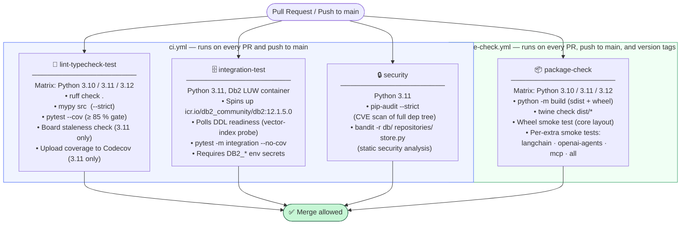

# SDD-9 · Deployment and Operations

**EPIC-9** | Status: current | Last updated: 2025

---

## Table of contents

1. [Packaging and distribution](#1-packaging-and-distribution)
2. [Configuration reference](#2-configuration-reference)
3. [Schema policy and migration guidance](#3-schema-policy-and-migration-guidance)
4. [CI/CD pipeline](#4-cicd-pipeline)
5. [Operational script catalog](#5-operational-script-catalog)
6. [Operator-facing exception reference](#6-operator-facing-exception-reference)

---

## 1. Packaging and distribution

### Build backend

The project uses **[hatchling](https://hatch.pypa.io/latest/backend/)** as its PEP 517/518 build backend, declared in [`pyproject.toml`](../../pyproject.toml:1):

```toml
[build-system]
requires = ["hatchling"]
build-backend = "hatchling.build"
```

Hatchling was chosen over setuptools for zero-config `src/` layout discovery, first-class PEP 660 editable installs, and a lighter build tree suitable for a library this size.

### Package name and wheel contents

| Attribute | Value |
|---|---|
| **PyPI name** | `agent-memory-sdk` |
| **Version** | `0.1.0` |
| **Requires-Python** | `>=3.10` |
| **License** | Apache-2.0 |
| **Wheel source** | `src/agent_memory_sdk/` (all subpackages) |

The [`[tool.hatch.build.targets.wheel]`](../../pyproject.toml:123) section pins the wheel content to exactly `src/agent_memory_sdk/`. Everything else in the repository — `project-management/`, `benchmarks/`, `scripts/`, `tests/` — is excluded from the wheel by omission and is never shipped to end users installing from PyPI.

### Core dependencies

These are always installed regardless of extras:

| Package | Version floor | Purpose |
|---|---|---|
| `ibm_db` | `>=3.2.9` | IBM Db2 native driver (C extension) |
| `pydantic` | `>=2.13.4` | Data models and validation (v2) |
| `python-dotenv` | `>=1.2.2` | `.env` file loading in scripts and local dev |

> **`ibm_db` and the clidriver:** `pip install` automatically downloads and bundles the IBM clidriver alongside the C extension — no separate Db2 client installation is required on most platforms. To use an existing full DB2 client instead, set the `IBM_DB_HOME` environment variable before installing (see [Section 2](#2-configuration-reference)). On Windows Python 3.8+, `os.add_dll_directory('<clidriver>/bin')` must be called before `import ibm_db`; the SDK's `db/connection.py` handles this automatically.

### Optional extras

Install any extra alongside the core package:

```bash
pip install "agent-memory-sdk[<extra>]"
```

| Extra | Additional packages installed | Use case |
|---|---|---|
| `langchain` | `langchain-core>=1.5.3` | LangChain `BaseMemory` / `BaseChatMessageHistory` adapters |
| `openai-agents` | `openai-agents>=0.19.1` | OpenAI Agents SDK memory adapter |
| `mcp` | `mcp>=1.19.0,<2` | Model Context Protocol server adapter |
| `agent-framework` | `agent-framework` | Microsoft Agent Framework `ContextProvider`/`HistoryProvider` adapter |
| `all` | All four extras above | Install every adapter at once |

The `dev` extra (`pytest`, `ruff`, `mypy`, `bandit`, `pip-audit`, etc.) is for contributors only and is never declared as a runtime dependency.

---

## 2. Configuration reference

All connection and runtime parameters are read from environment variables. Copy [`.env.example`](../../.env.example) to `.env`, fill in values, and **never commit a filled-in `.env` file** (it is listed in `.gitignore`).

| Variable | Required? | Default | Description |
|---|---|---|---|
| `DB2_DATABASE` | **Yes** | — | Name of the Db2 database to connect to (e.g. `MYDB`) |
| `DB2_HOSTNAME` | **Yes** | — | Hostname or IP address of the Db2 server (e.g. `localhost`) |
| `DB2_UID` | **Yes** | — | Db2 user name used to authenticate (e.g. `db2inst1`) |
| `DB2_PWD` | **Yes** | — | Password for `DB2_UID`; keep secret and never commit |
| `DB2_PORT` | No | `50000` | TCP port on which Db2 is listening |
| `DB2_SECURITY` | No | _(none)_ | Set to `SSL` to enable encrypted transport; required for IBM Cloud / Db2 SaaS |
| `DB2_POOL_SIZE` | No | `5` | Number of persistent connections kept open in the pool (max 20) |
| `DB2_POOL_TIMEOUT` | No | `30` | Seconds to wait for a free connection before raising an error |
| `IBM_DB_WIN_DLL_DIR` | No | _(none)_ | **Windows only.** Absolute path to the clidriver `/bin` directory (e.g. `C:\Program Files\IBM\CLIDRIVER\bin`). Required when `ibm_db` cannot locate its DLL automatically on Windows Python 3.8+. |
| `IBM_DB_HOME` | No | _(none)_ | Override the bundled clidriver; point to an existing installed DB2 client (e.g. `/opt/ibm/db2/V12.1`) |
| `CLIDRIVER_VERSION` | No | _(none)_ | Pin the bundled clidriver version downloaded by `ibm_db` at install time (e.g. `v12.1.0`) |

> The table above contains exactly the 11 variables defined in `.env.example` — 4 required and 7 optional (including 3 that are commented-out by default).

---

## 3. Schema policy and migration guidance

The [`Migrator`](../../src/agent_memory_sdk/db/migrate.py:256) class accepts a `schema_policy` constructor argument of type [`SchemaPolicy`](../../src/agent_memory_sdk/db/migrate.py:228), an enum with two members. Choosing the right policy for each environment is a key operational decision.

### `SchemaPolicy.CREATE_IF_NECESSARY` — development and testing

```python
from agent_memory_sdk.db.connection import ConnectionPool
from agent_memory_sdk.db.migrate import Migrator

pool = ConnectionPool()
Migrator(pool).run()          # CREATE_IF_NECESSARY is the default
```

- Applies all pending `.sql` migration files (in `src/agent_memory_sdk/db/migrations/`) in lexicographic order.
- **Creates all tables, columns, and vector indexes** if they do not already exist; existing objects are left untouched.
- Tracks applied versions in a `schema_migrations` table, which is itself bootstrapped on first run.
- Suitable for: **local development**, **automated tests**, **first-time deployment** where the application user has DDL privileges.

### `SchemaPolicy.REQUIRE_EXISTING` — production

```python
from agent_memory_sdk.db.connection import ConnectionPool
from agent_memory_sdk.db.migrate import Migrator, SchemaPolicy

pool = ConnectionPool()
# Raises SchemaPolicyError at startup if anything is missing.
Migrator(pool, schema_policy=SchemaPolicy.REQUIRE_EXISTING).validate()
```

- **Executes zero DDL.** Queries only `SYSCAT.TABLES`, `SYSCAT.COLUMNS`, and `SYSCAT.INDEXES` in three read-only catalog round-trips.
- Validates that every expected table, column, and vector index already exists in the database.
- If anything is missing, raises [`SchemaPolicyError`](../../src/agent_memory_sdk/exceptions.py:91) with a single, complete message listing **all** missing objects so the DBA can provision them in one pass before restarting the application.
- Suitable for: **production environments** where the application database user does not hold DDL privileges and a DBA-managed change-management process provisions the schema separately before application startup.

### Deployment workflow recommendation

| Environment | Policy | Who runs the DDL |
|---|---|---|
| Local dev / CI unit tests | `CREATE_IF_NECESSARY` | Application / migration runner |
| Staging (DBA-managed) | `REQUIRE_EXISTING` | DBA applies `.sql` files; app validates on startup |
| Production | `REQUIRE_EXISTING` | DBA applies `.sql` files via change ticket; app validates on startup |

**Recommended production startup sequence:**

1. DBA applies any new `.sql` files from `src/agent_memory_sdk/db/migrations/` via the approved change-management process.
2. Application starts up and calls `Migrator(pool, schema_policy=SchemaPolicy.REQUIRE_EXISTING).validate()`.
3. If validation succeeds (exit 0), the application continues normally.
4. If `SchemaPolicyError` is raised, the process exits immediately with the full list of missing objects — the DBA addresses them and the application is restarted.

> **Note on DDL atomicity:** Db2 auto-commits DDL. If a migration file fails mid-way, already-applied statements within that file cannot be rolled back. The version record is inserted only after **all** statements in the file succeed, so re-running the migration will retry the whole file. Design migration files to be idempotent where possible.

---

## 4. CI/CD pipeline

All four gates below are **required for PR merge**. They run in parallel where possible to minimise feedback latency.



### Gate details

| # | Gate | Workflow file | Trigger | Key tools | Notes |
|---|---|---|---|---|---|
| 1 | `lint-typecheck-test` | `ci.yml` | PR, push to `main`, manual | `ruff`, `mypy --strict`, `pytest --cov`, Codecov upload | 3×3 matrix (Python 3.10/3.11/3.12); `--cov-fail-under=85` enforced |
| 2 | `integration-test` | `ci.yml` | PR, push to `main`, manual | `pytest -m integration` against live Db2 LUW container | Runs independently of the unit matrix to avoid blocking fast feedback; requires `DB2_*` env secrets |
| 3 | `security` | `ci.yml` | PR, push to `main`, manual | `pip-audit --strict`, `bandit -r` | Scoped to `db/`, `repositories/`, `store.py`; suppressed findings documented in `DECISIONS.md PH-4` |
| 4 | `package-check` | `package-check.yml` | PR, push to `main`, version tags (`v*`) | `python -m build`, `twine check`, per-extra smoke tests | Separate workflow; exercises wheel `RECORD` manifest and extras in isolated venvs |

> **Concurrency:** both workflows cancel superseded runs on the same branch/PR when a new commit is pushed, avoiding redundant pipeline runs.

---

## 5. Operational script catalog

All scripts live in [`scripts/`](../../scripts/) at the repository root. They are excluded from the published wheel. Each script reads connection parameters from environment variables (or a `.env` file) unless otherwise noted.

| Script | Purpose | Cron-appropriate? | Notes |
|---|---|---|---|
| [`check_connection.py`](../../scripts/check_connection.py) | Verify Db2 connectivity by opening a pooled connection and running a trivial query against `SYSIBM.SYSDUMMY1`. Exits 0 on success, 1 on failure. | No | One-shot diagnostic; run manually to validate environment after deployment or configuration changes |
| [`consolidate_pending.py`](../../scripts/consolidate_pending.py) | Background consolidation worker. Picks up rows where `consolidated_at IS NULL` using claim-based locking and runs the configured consolidator off the hot path. | **Yes** | Replaces the inline consolidator for production deployments that need fast write paths; safe to run concurrently (claim-locking prevents double-processing); schedule as a Kubernetes CronJob or cron entry |
| [`export_memory.py`](../../scripts/export_memory.py) | Export a tenant/agent's memory to a portable JSONL file. Each line carries a `_type` discriminator plus all model fields; datetimes are ISO-8601; embeddings are raw float lists. | **Yes** (backup) | Proprietary backup/portability format; not a cross-vendor interchange standard; use `--agent-id` (and optionally `--tenant-id`, `--user-id`, `--thread-id`) to scope the export |
| [`generate_benchmark_summary.py`](../../scripts/generate_benchmark_summary.py) | Parse a `pytest-benchmark` JSON output file and produce a Markdown table (for `$GITHUB_STEP_SUMMARY`) or self-contained HTML report (with `--html`). | No | Called from benchmark CI workflows; stdlib only — no third-party dependencies; exits 1 if the input file is missing but writes a placeholder so the calling step does not fail |
| [`generate_site_index.py`](../../scripts/generate_site_index.py) | Generate (or regenerate) the root `index.html` for the GitHub Pages site. Scans the `benchmarks/` subfolder for numbered run directories and writes a navigation hub with Home, Board, and Benchmarks tabs. | No | Called from `benchmarks.yml` on every publish to the `gh-pages` branch; stdlib only; IBM Carbon Design-inspired styling |
| [`import_memory.py`](../../scripts/import_memory.py) | Import a tenant/agent's memory from a JSONL file produced by `export_memory.py`. Calls `MemoryStore.import_scope()` and prints a per-type summary. `memory_chunks` records are skipped (they are regenerated by `create()` on the target store). | No | Scope validation is strict: every record's `agent_id` (and `tenant_id` when non-`None`) must match the target scope; use once per distinct scope when importing multi-scope exports |
| [`purge_expired.py`](../../scripts/purge_expired.py) | Maintenance script: hard-delete tombstoned rows (where `deleted_at IS NOT NULL`) from all five memory tables for a given scope. Supports `--dry-run`. | **Yes** | Must be scheduled explicitly (daily recommended); the SDK never calls `purge_expired()` automatically; requires at minimum `--agent-id` to avoid accidentally touching other agents' data |
| [`smoke_test.py`](../../scripts/smoke_test.py) | Minimal packaging smoke test. Verifies the top-level package is importable and that one representative symbol from each of the three module groups (models, store, db) is accessible from a wheel-installed copy. | No | Called by the `package-check` CI job (`package-check.yml`); stdlib only; must not require a live Db2 instance; exits non-zero with a descriptive message on any failure |

---

## 6. Operator-facing exception reference

All custom exceptions are defined in [`src/agent_memory_sdk/exceptions.py`](../../src/agent_memory_sdk/exceptions.py). The table below documents each from an operator's perspective — what triggers it and how to respond.

| Exception | Base class | What triggers it | Operator response |
|---|---|---|---|
| [`StaleWriteError`](../../src/agent_memory_sdk/exceptions.py:10) | `Exception` | An optimistic-concurrency `update()` call found that the target row was modified by another writer between the caller's `get_by_id()` and their `update()`. The `UPDATE` affected 0 rows. | Re-fetch the latest row with `get_by_id()`, apply the desired changes to the fresh copy, and retry `update()`. This is a normal condition under concurrent load, not a bug — implement a short retry loop (3 attempts recommended). |
| [`InvalidMetadataFilterError`](../../src/agent_memory_sdk/exceptions.py:38) | `ValueError` | A `metadata_filter` dict passed to `list_all()` (or similar) contained an unrecognised `$` operator key. Supported operators: `$not`, `$array_contains`, `$array_contains_any`. Any other `$`-prefixed key is rejected immediately. | Review and correct the `metadata_filter` argument. Do not use unsupported operators such as `$in` or `$gt`; use the documented operator set. |
| [`ScopeMismatchError`](../../src/agent_memory_sdk/exceptions.py:58) | `ValueError` | `MemoryStore.import_scope()` detected that an imported record's scope columns (`tenant_id`, `agent_id`, `user_id`, `thread_id`) do not match the target scope supplied on the command line or API call. Without this guard, `create()` would silently rewrite the record's scope. | Either re-export from the correct source scope, or call `import_scope()` once per distinct scope present in the record stream. |
| [`ScopeImportError`](../../src/agent_memory_sdk/exceptions.py:78) | `ScopeMismatchError` (`ValueError`) | Same trigger as `ScopeMismatchError`; this is the concrete subclass raised by `import_scope()` for the stored-scope-vs-target-scope check. | Same response as `ScopeMismatchError`. Callers that already catch `ScopeMismatchError` will catch `ScopeImportError` without modification (Liskov-safe). |
| [`SchemaPolicyError`](../../src/agent_memory_sdk/exceptions.py:91) | `RuntimeError` | `SchemaPolicy.REQUIRE_EXISTING` validation failed: one or more expected tables, columns, or vector indexes are absent from the database schema. The exception message lists **every** missing object so the DBA can provision them in a single pass. | Apply the missing DDL from `src/agent_memory_sdk/db/migrations/` (or have the DBA apply it via the change-management process) before restarting the application. Do not suppress this exception — it indicates the application cannot operate correctly against the current schema. |

### Example: handling `SchemaPolicyError` at startup

```python
import sys
from agent_memory_sdk.db.connection import ConnectionPool
from agent_memory_sdk.db.migrate import Migrator, SchemaPolicy
from agent_memory_sdk.exceptions import SchemaPolicyError

pool = ConnectionPool()
try:
    Migrator(pool, schema_policy=SchemaPolicy.REQUIRE_EXISTING).validate()
except SchemaPolicyError as exc:
    # exc.args[0] contains the full list of missing objects.
    print(f"[FATAL] Schema validation failed:\n{exc}", file=sys.stderr)
    pool.close()
    sys.exit(1)
```

### Example: retrying on `StaleWriteError`

```python
from agent_memory_sdk.exceptions import StaleWriteError

for attempt in range(3):
    record = repo.get_by_id(record_id, scope)
    if record is None:
        break
    record.content = new_content
    try:
        repo.update(record, scope)
        break                        # success
    except StaleWriteError:
        continue                     # retry with refreshed record
else:
    raise RuntimeError("Could not update after 3 attempts")
```
